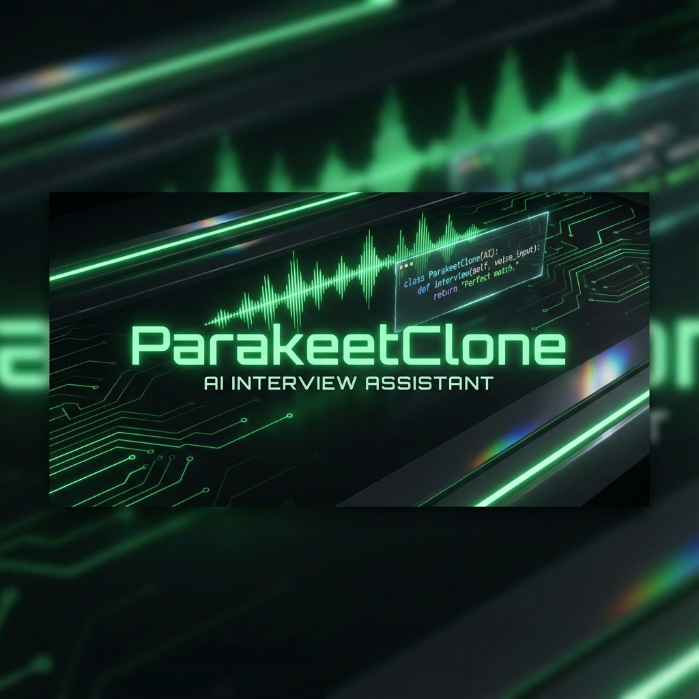
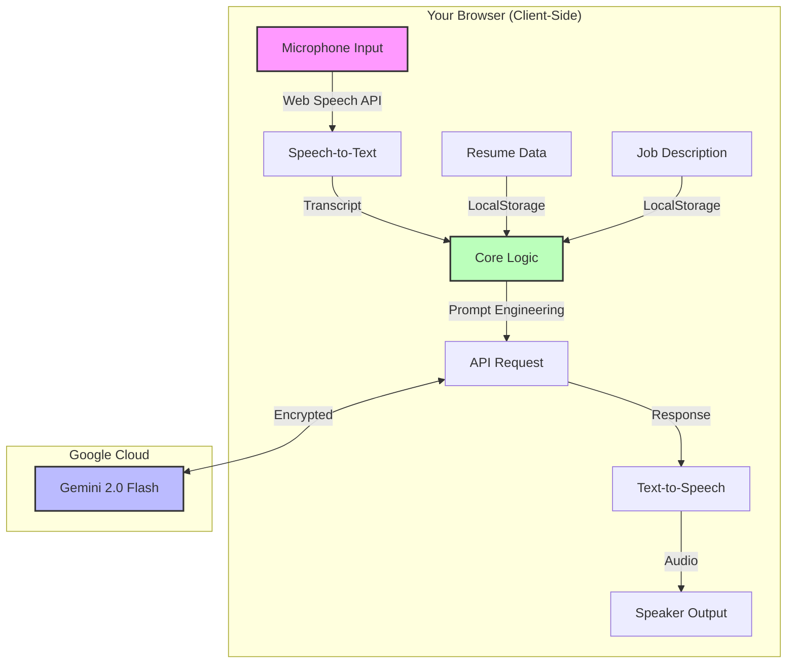
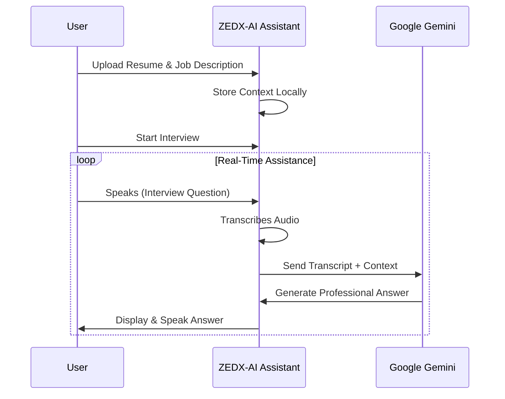

# ZEDX-AI Assistant: The AI Interview Copilot



<div align="center">

[](https://nextjs.org/)
[](https://www.typescriptlang.org/)
[](https://tailwindcss.com/)
[](https://deepmind.google/technologies/gemini/)
[](LICENSE)

**Ace your next job interview with a real-time, privacy-first AI assistant.**

</div>

---

## Overview

**ZEDX-AI Assistant** is a cutting-edge AI Interview Assistant designed to help you land your dream job. It listens to your interview in real-time, understands the context from your **Resume** and the **Job Description**, and generates the perfect answer instantly using **Google Gemini 2.0**.

Unlike other tools, ZEDX-AI Assistant runs **entirely in your browser** (Client-Side), ensuring your data never leaves your device except to talk to the AI API.

## System Architecture



## User Flow



## Key Features

| Feature | Description |
| :--- | :--- |
| **Real-Time Transcription** | Uses the Web Speech API for instant, zero-latency speech-to-text. |
| **Context-Aware AI** | Upload your Resume and Job Description. The AI *knows* who you are and what you're applying for. |
| **Multi-Model Intelligence** | Automatically falls back between `gemini-2.0-flash-lite`, `gemini-1.5-flash`, and `gemini-pro` to ensure 100% uptime. |
| **Auto-Answer Mode** | Detects when you stop speaking and generates an answer automatically. |
| **Privacy First** | No database. No server. Your API keys and transcripts are stored in your browser's LocalStorage. |
| **Multi-Language Support** | Fluent in English, Arabic, Spanish, and French. |
| **Stealth Mode** | Toggle the camera and UI to keep the assistant invisible during screen shares. |

## Tech Stack

*   **Framework**: [Next.js 15](https://nextjs.org/) (App Router)
*   **Language**: [TypeScript](https://www.typescriptlang.org/)
*   **Styling**: [Tailwind CSS](https://tailwindcss.com/) + [Lucide Icons](https://lucide.dev/)
*   **AI**: [Google Generative AI SDK](https://www.npmjs.com/package/@google/generative-ai)
*   **Speech**: Native Web Speech API (SpeechRecognition & SpeechSynthesis)

## Screenshots

| **Dashboard** | **Interview Interface** |
|:---:|:---:|
|  |  |

*(Note: Add your own screenshots to `public/` folder)*

## Getting Started

### Prerequisites

*   Node.js 18+ installed.
*   A free [Google Gemini API Key](https://aistudio.google.com/app/apikey).

### Installation

1.  **Clone the repository**
    ```bash
    git clone https://github.com/ziademad02153/ZEDX-AI-Assistant.git
    cd ZEDX-AI-Assistant
    ```

2.  **Install dependencies**
    ```bash
    npm install
    ```

3.  **Run the development server**
    ```bash
    npm run dev
    ```


5.  **Setup**
    *   Go to **Start New Interview**.
    *   Paste your Resume & Job Description.
    *   Enter your Gemini API Key when prompted.
    *   Start aceing your interviews!

## Privacy Policy

We believe in **Local-First Software**.
*   **API Keys**: Stored in `localStorage`. Never sent to our servers.
*   **Transcripts**: Processed in memory.
*   **Resumes**: Parsed client-side.

## Contributing

Contributions are what make the open source community such an amazing place to learn, inspire, and create. Any contributions you make are **greatly appreciated**.

1.  Fork the Project
2.  Create your Feature Branch (`git checkout -b feature/AmazingFeature`)
3.  Commit your Changes (`git commit -m 'Add some AmazingFeature'`)
4.  Push to the Branch (`git push origin feature/AmazingFeature`)
5.  Open a Pull Request

## License

Distributed under the MIT License. See `LICENSE` for more information.

---

<div align="center">

**Star this repo if you find it useful!**

Made by [Ziad Emad]

</div>
