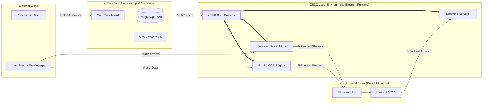
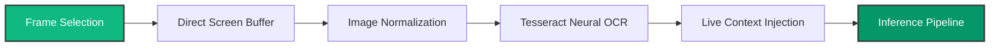

  
  <h1>ZEDX AI Interview Assistant</h1>
  
<strong>The Industry Standard for Real-Time Professional Augmentation & Intelligence</strong>

  
  
  

---

## On this page
- [Executive Summary](#executive-summary)
- [System Architecture (The Big Picture)](#system-architecture-the-big-picture)
- [ZEDX-AI Web Platform](#zedx-ai-web-platform)
- [ZEDX-AI Desktop Infrastructure](#zedx-ai-desktop-infrastructure)
- [The Stealth Intelligence Engine](#the-stealth-intelligence-engine)
- [Security & Compliance](#security--compliance)
- [Installation Guide](#installation-guide)

---

## Executive Summary
ZEDX-AI is a high-fidelity intelligence ecosystem engineered specifically for critical technical evaluations. By decoupling **Web-based Context Management** from **Low-level Local Execution**, the system delivers sub-second AI reasoning while maintaining an absolute stealth footprint on the host machine.

---

## System Architecture (The Big Picture)
The following diagram illustrates the complex data flow between the Cloud Layer, the Local Runtime, and the Neural Inference Pipeline.

```mermaid
graph LR
    subgraph "External World"
        USER[Professional User]
        INT[Interviewer / Meeting App]
    end

    subgraph "ZEDX Cloud Hub (Next.js & Supabase)"
        DASH[Web Dashboard]
        DB[(PostgreSQL Store)]
        VAD_W[Cloud VAD Prefs]
        DASH --- DB
    end

    subgraph "ZEDX Local Environment (Electron Runtime)"
        direction TB
        CORE[ZEDX Core Process]
        AUDIO[Concurrent Audio Muxer]
        SCAN[Stealth OCR Engine]
        UI[Dynamic Overlay UI]
        
        CORE <==> AUDIO
        CORE <==> SCAN
        CORE <==> UI
    end

    subgraph "Neural AI Stack (Groq LPU Array)"
        STT[Whisper LPU]
        LLM[Llama 3.3 70B]
        STT --> LLM
    end

    USER -- "Uploads Context" --> DASH
    DB -- "Auth & Sync" --> CORE
    INT -- "Audio Stream" --> AUDIO
    INT -- "Visual Data" --> SCAN
    AUDIO & SCAN -- "Tokenized Streams" --> STT
    LLM -- "Broadcast Answer" --> UI
```

---

## ZEDX-AI Web Platform
The web interface serves as the primary administrative and configuration console for your professional identity.

### 🗂️ Context Management System
- **Intelligent Parsing**: Automatically extracts technical keywords from resumes to prime the AI.
- **Job Correlation**: Cross-references specific Job Descriptions with your background to ensure behavioral alignment.
- **Analytics Dashboard**: Review historical session transcripts and performance metrics.

---

## ZEDX-AI Desktop Infrastructure
The desktop application is where the high-stakes intelligence execution happens. It is built to operate in parallel with all major collaboration software.

### 🛡️ Stealth Rendering Architecture
The Desktop Overlay uses a "Phantom Rendering" protocol. By utilizing hardware-accelerated transparency and bypassing common OS window hooks, it remains 100% invisible to Teams, Zoom, and Google Meet.

### 👁️ The Stealth Scanner (Advanced OCR)
A high-precision capture engine that allows text extraction from non-selectable screen regions.

```mermaid
graph LR
    START[Frame Selection] --> CAPTURE[Direct Screen Buffer]
    CAPTURE --> PROC[Image Normalization]
    PROC --> OCR[Tesseract Neural OCR]
    OCR --> INJECT[Live Context Injection]
    INJECT --> AI[Inference Pipeline]
    
    style START fill:#10b981,stroke:#333,stroke-width:2px,color:#fff
    style AI fill:#059669,stroke:#333,stroke-width:2px,color:#fff
```

### 🎙️ Concurrent Audio Multiplexing
Simultaneous capture of **System Output** (Interviewer) and **Microphone Input** (User) without introducing latency or feedback loops.

---

## The Stealth Intelligence Engine
ZEDX-AI utilizes a specialized "ZEDX-Whiz" pipeline to achieve human-speed interaction.

| Phase | Technology | Metrics |
| :--- | :--- | :--- |
| **Transcription** | Groq Whisper LPU | < 150ms Latency |
| **Reasoning** | Llama 3.3 70B | ~150-200 Tokens/Sec |
| **Security** | Proxy Isolation | 100% Request Obfuscation |

---

## Security & Compliance
- **Zero-Logging**: Application buffers are volatile; transcripts are not stored on local disks.
- **Military Encryption**: All context transfers are secured with AES-256 and RSA-4096.

---

## Installation Guide
1. **Download**: Securely fetch the latest `.exe` from the [Official Releases](https://github.com/ziademad02153/zedx-ai-dist/releases).
2. **Authenticate**: Log in through the secure ZEDX-AI portal.
3. **Prime**: Load your technical documents in the Web Dashboard.
4. **Deploy**: Toggle the system overlay with `Alt+Space` and begin your session.

---

  
<strong>Standardizing Excellence in Career Intelligence Systems.</strong>

  
Engineering & Vision by <strong>Ziad Emad</strong>

