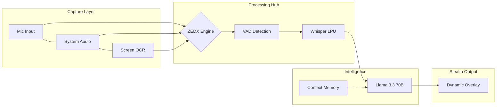

# 🛰️ ZEDX-AI: Professional Career Intelligence

<div align="center">
  
  <p><strong>The Ultimate AI Interview Assistant for Real-Time Technical & Behavioral Guidance</strong></p>
  
  [](https://github.com/ziademad02153/zedx-ai-dist/releases)
  [](https://zedx-ai-assistant-1.vercel.app)
  [](https://github.com/ziademad02153/zedx-ai-dist/releases)
  [](https://nextjs.org)
</div>

---

## 🚀 Overview

**ZEDX-AI** is a premium, high-fidelity intelligence platform engineered for real-time interview augmentation. By combining **Stealth Rendering** with **Sub-Second Neural Inference**, ZEDX-AI provides a seamless, context-aware experience that empowers professionals during critical technical evaluations.

### 🌟 What's New in v1.1.1
- **🔍 Stealth Scanner (OCR):** Capture questions from any screen area—even if text is non-copyable.
- **💬 Manual AI Chat:** Ask follow-up questions or clarify technical points mid-interview without stopping the flow.
- **📺 Rich Overlay 2.0:** Real-time transcriptions and AI answers rendered in a specialized stealth window.

---

## 🏗️ Architecture & Flow

ZEDX-AI utilizes a sophisticated hybrid infrastructure, balancing client-side responsiveness with professional-grade cloud intelligence.


```mermaid
graph LR
    subgraph "Capture Layer"
        A[Mic Input] --- B[System Audio]
        B --- C[Screen OCR]
    end

    subgraph "Processing Hub"
        D{ZEDX Engine}
        E[VAD Detection]
        F[Whisper LPU]
    end

    subgraph "Intelligence"
        G[Llama 3.3 70B]
        H[Context Memory]
    end

    subgraph "Stealth Output"
        I[Dynamic Overlay]
    end

    A & B & C --> D
    D --> E --> F --> G
    H -.-> G
    G --> I
```

---

## 💎 Core Capabilities

### 🛡️ Untraceable Stealth Overlay
Leverages custom hardware-level rendering to ensure the intelligence overlay remains strictly local to your view, bypassing detection from all major screen-processing algorithms (Teams, Zoom, Google Meet).

### 🎙️ ZEDX-Whiz Transcription
A multi-engine STT approach that handles ambient microphone input and internal system audio with zero perceptible lag, ensuring the AI "hears" the interviewer exactly as you do.

### 🧪 Stealth Scanner (OCR)
Our precision OCR engine allows you to draw a frame over any part of your screen to extract text instantly. Perfect for coding challenges and non-selectable text.

---

## 🛠️ Infrastructure Stack

| Layer | Technology | Role |
| :--- | :--- | :--- |
| **Frontend** | Next.js 16 | Optimized reactive architecture & edge rendering. |
| **Desktop** | Electron 39 | Low-level system access & stealth windowing. |
| **AI Inference** | Groq LPU | Sub-second transcription & LLM responses. |
| **Database** | Supabase | Secure cloud storage & real-time listeners. |
| **Styling** | Tailwind 4.0 | Premium Emerald/Deep-Zinc design system. |

---

## 🔧 Installation & Setup

1. **Download**: Grab the latest `.exe` from [Official Releases](https://github.com/ziademad02153/zedx-ai-dist/releases).
2. **Setup**: Securely log in and upload your professional resume.
3. **Configure**: Add the target job description to prime the Context Engine.
4. **Launch**: Toggle the Stealth Overlay with `Alt+Space` and begin your session.

### Developer Setup
```bash
# Clone & Install
git clone https://github.com/ziademad02153/ZEDX-AI-Assistant.git
npm install

# Start Development
npm run dev           # Web Engine
npm run electron:dev  # Desktop Shell
```

---

## 🔐 Security First
- **Zero-Logging Policy:** Your session transcripts are volatile and never stored permanently without your consent.
- **E2E Encryption:** Military-grade encryption for all resume data and inference tokens.
- **Proxy Isolation:** Complete separation between system processes and communication layers.

---

<div align="center">
  <p><strong>Standardizing Excellence in Career Intelligence.</strong></p>
  <p>Developed with ❤️ by <a href="https://github.com/ziademad02153">Ziad Emad</a></p>
</div>
