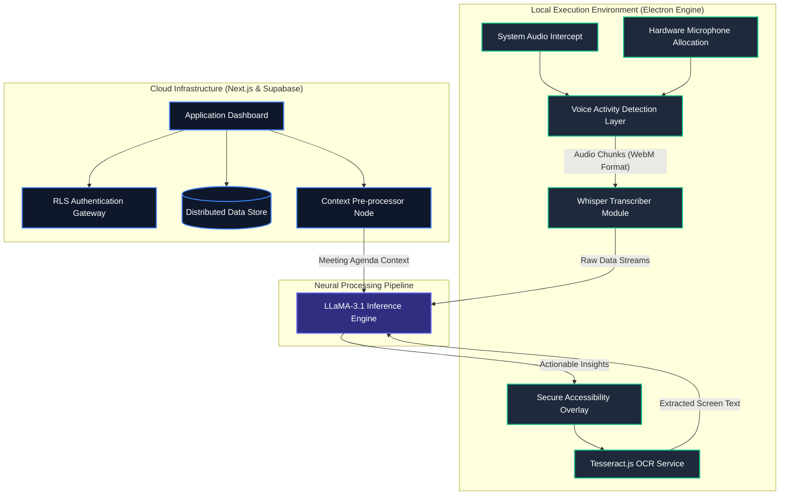

  

  # ZEDX Copilot
  ### Professional AI Meeting & Accessibility Infrastructure

## System Overview
**ZEDX Copilot** is a high-availability, real-time audio processing and transcription ecosystem engineered to optimize online professional meetings. The platform interfaces directly with operating system audio layers and cloud-based Large Language Models (LLMs), executing deterministic transcriptions and contextual analysis with sub-second latency while maintaining an unobtrusive, accessible workspace environment.

---

## Infrastructure Architecture
The following topology illustrates the orchestration between the Cloud Layer, the Local Runtime Environment, and the Neural Inference Pipeline.

```mermaid
graph TD
    subgraph "Cloud Infrastructure (Next.js & Supabase)"
        WEB[Application Dashboard] --> AUTH[RLS Authentication Gateway]
        WEB --> DB[(Distributed Data Store)]
        WEB --> CONTEXT[Context Pre-processor Node]
    end

    subgraph "Local Execution Environment (Electron Engine)"
        SYS[System Audio Intercept] --> VAD[Voice Activity Detection Layer]
        MIC[Hardware Microphone Allocation] --> VAD
        VAD -- "Audio Chunks (WebM Format)" --> STT[Whisper Transcriber Module]
        SCREEN[Secure Accessibility Overlay] --> OCR[Tesseract.js OCR Service]
    end

    subgraph "Neural Processing Pipeline"
        STT -- "Raw Data Streams" --> LLM[LLaMA-3.1 Inference Engine]
        CONTEXT -- "Meeting Agenda Context" --> LLM
        OCR -- "Extracted Screen Text" --> LLM
        LLM -- "Actionable Insights" --> SCREEN
    end

    classDef cloud fill:#0f172a,stroke:#3b82f6,stroke-width:2px,color:#fff;
    classDef local fill:#1e293b,stroke:#10b981,stroke-width:2px,color:#fff;
    classDef neural fill:#312e81,stroke:#6366f1,stroke-width:2px,color:#fff;

    class WEB,AUTH,DB,CONTEXT cloud;
    class SYS,MIC,VAD,STT,SCREEN,OCR local;
    class LLM neural;
```

---

## Core Operational Modules

### Live Audio Processing (STT Engine)
Powered by an optimized, low-latency deployment of Groq Whisper API utilizing local Web Speech API fallbacks for robust redundancy:
- **Zero-Latency Transcription:** Transcribes system-level audio and discrete microphone inputs systematically.
- **Multilingual Support:** Native processing for English, Arabic (including complex regional dialects), Spanish, and 30+ international languages.
- **VAD (Voice Activity Detection):** Implements heuristic silence-trimming calibrated to 12ms thresholds to mitigate API payload bloat and preserve isolated context continuous streams.

### Real-Time Cognitive Parsing (LLM Engine)
Integrates highly performant LLaMA 3.1 architectures to process and index spoken dialogue actively:
- **Meeting Context Awareness:** Cross-validates incoming transcription streams against pre-loaded meeting agendas or context documentation dynamically.
- **Global Best Practices Retrieval:** Fetches and synthesizes verifiable technical query responses instantly by indexing verified professional methodologies.
- **Accessibility Auto-Summarization:** Generates chronologically segmented bulleted summaries extracted from high-velocity discussions to support users requiring immediate cognitive reinforcement.

### Enterprise-Grade Security
- **Data Sovereignty Governance:** Forces isolated API request execution utilizing ephemeral, short-lived tokens. No conversational data is persisted in long-term storage outside user bounds.
- **Row-Level Security (RLS):** All transcribed sessions and operational logs are secured via stringent Supabase RLS policies achieving complete cryptographic isolation between organizational accounts.
- **Opaque Token Authentication:** Upgraded legacy JWT structures to mathematically secure Publishable API integration patterns mitigating token-sniffing vulnerabilities.

---

## Architectural Deep Dive

ZEDX Copilot is structured around a sophisticated Micro-Frontend / IPC (Inter-Process Communication) topology:

1. **The Core (Next.js 16 + React 19):** Hosts the computational React logic, orchestrating strict `Zustand` state models for managing distributed audio streams, UI rendering lifecycles, and API synchronicity.
2. **The Wrapper (Electron.js):** Functions as the secure hardware bridge. Leveraging `desktopCapturer` configurations and deeply sandboxed `preload.js` scripts, the application intercepts target desktop audio streams and renders the "Live Accessibility Overlay" cleanly without intruding upon video conferencing protocol agents.
3. **The IPC Bridge:** Facilitates secure communication pipelines connecting the React web context to native Node.js hardware access protocols (microphone allocations, screen dimension boundaries, auto-updater mechanisms) while maintaining absolute browser security sandboxing.

## Engineering Challenges Overcome
- **Audio Device Partitioning:** Engineered custom arbitration layers to resolve asynchronous race conditions between the Chrome `MediaDevices` API standard and Electron’s strict media allocation permissions.
- **Micro-Latency API Handling:** Implemented bidirectional `TransformStream` pipelines leveraging the Next.js Edge Runtime to parse and render Server-Sent Events (SSE) packet-by-packet.
- **React Hydration in Node Environments:** Achieved a zero-flicker "White-Screen Free" initialization sequence by structurally isolating global state mechanisms from `window` objects during Next.js SSR compilation passes.

---

## Future Blueprint (MLH Technical Milestones)
- **Offline Transcription Models:** Deployment of ONNX WebAssembly (WASM) models to execute intensive transcriptions statically within a 100% offline, privacy-first topology.
- **Speaker Diarization Vectors:** AI-driven biometric voice clustering to assign and tag distinct "Speaker 1" and "Speaker 2" labels dynamically across congested multi-party environments.
- **Sign-Language Avatar Integration:** Forward-looking infrastructure research for WebGL computational rendering modules.

### Developed by Ziad Emad
*Committed to engineering software that bridges the gap between complex AI systems and daily human scalability.*
