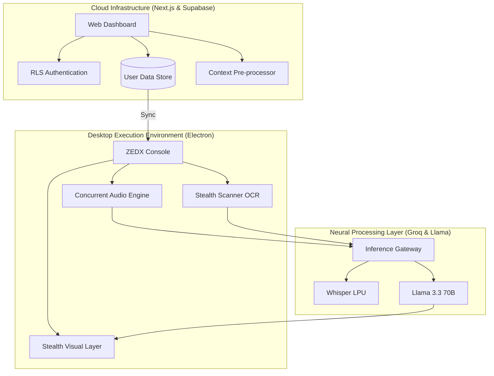
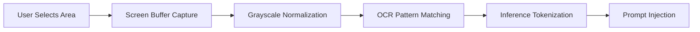
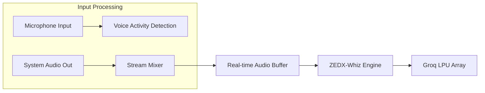

# ZEDX-AI: Professional Intelligence & Career Augmentation Systems

## System Overview
ZEDX-AI is a multi-tier intelligence ecosystem engineered to facilitate high-fidelity professional evaluations. The platform merges cloud-based context management with a low-level desktop execution environment, ensuring real-time AI guidance with sub-second latency and zero-detection footprints.

---

## Infrastructure Architecture
The following diagram illustrates the high-level orchestration between the Cloud Layer, the Local Runtime, and the Neural Inference Pipeline.


```mermaid
graph TD
    subgraph "Cloud Infrastructure (Next.js & Supabase)"
        WEB[Web Dashboard] --> AUTH[RLS Authentication]
        WEB --> DB[(User Data Store)]
        WEB --> CONTEXT[Context Pre-processor]
    end

    subgraph "Desktop Execution Environment (Electron)"
        APP[ZEDX Console] --> SCAN[Stealth Scanner OCR]
        APP --> AUDIO[Concurrent Audio Engine]
        APP --> OVERLAY[Stealth Visual Layer]
    end

    subgraph "Neural Processing Layer (Groq & Llama)"
        INF[Inference Gateway] --> STT[Whisper LPU]
        INF --> LLM[Llama 3.3 70B]
    end

    DB -- Sync --> APP
    AUDIO & SCAN --> INF
    LLM --> OVERLAY
```

---

## Chapter 1: ZEDX-AI Web Platform
The web component acts as the centralized command center for professional identity and data persistence.

### Context Engine and Data Ingestion
The platform utilizes a specialized ingestion pipeline for processing professional documentation. Resumes and Job Descriptions are not merely stored; they are parsed into structured context blocks that prime the AI engine before a session begins.

### Key Features
- **Stealth Scanner & Overlay**: Capture interview questions via screenshot or live transcription without detection.
- **Real-Time AI Answers**: Get instant suggestions for coding, behavioral, and technical questions.
- **Voice-to-Text**: High-accuracy speech recognition supports various accents and dialects.
- **Resume Parsing**: Analyze your resume to tailor responses specifically for you.

### Session Analytics and Persistence
- **Military-Grade Security**: Data is protected via Supabase Row Level Security (RLS), ensuring no unauthorized access to sensitive interview transcripts.
- **Cross-Device Sync**: Configuration and context data are seamlessly synchronized with the desktop client via secure real-time listeners.

---

## Chapter 2: The Desktop Intelligence Console
The desktop application is the primary execution shell for live interview augmentation.

### Stealth Scanner (Optic Logic)
The Stealth Scanner uses a localized OCR engine to capture non-selectable text from the screen.


```mermaid
flowchart LR
    A[User Selects Area] --> B[Screen Buffer Capture]
    B --> C[Grayscale Normalization]
    C --> D[OCR Pattern Matching]
    D --> E[Inference Tokenization]
    E --> F[Prompt Injection]
```

### Zero-Detection Overlay (Rendering Protocol)
The ZEDX rendering engine employs a "Phantom Layer" strategy. By utilizing hardware-accelerated transparent windowing and bypassing standard window hooks, the overlay remains invisible to all collaboration suites (Teams, Zoom, Google Meet).

### Concurrent Audio Stream Processor
A low-level listener captures system-out (interviewer's voice) and mic-in (user's voice) simultaneously.


```mermaid
graph LR
    subgraph "Input Processing"
        MIC[Microphone Input] --> VAD[Voice Activity Detection]
        SYS[System Audio Out] --> MIX[Stream Mixer]
    end
    
    MIX --> BUFFER[Real-time Audio Buffer]
    BUFFER --> WHIZ[ZEDX-Whiz Engine]
    WHIZ --> GROQ[Groq LPU Array]
```

---

## Chapter 3: Neural Processing & Inference Logic
ZEDX-AI utilizes a load-balanced inference strategy to maintain sub-second responsiveness.

### Inference Lifecycle
1.  **Tokenization**: Real-time STT converts audio buffers into text tokens via Groq-accelerated Whisper models.
2.  **Context Resolution**: The engine injects the user's pre-loaded professional context (Resume/JD) into the current turn.
3.  **Generative Reasoning**: Llama 3.3 70B synthesizes the response, prioritizing technical accuracy and behavioral alignment.
4.  **Display**: The final answer is pushed to the Stealth Overlay via an IPC (Inter-Process Communication) broadcast.

---

## Chapter 4: Security and Privacy Protocols
The system is architected on a foundation of absolute privacy and untraceability.

| Protocol | Implementation | Objective |
| :--- | :--- | :--- |
| **Proxy Isolation** | Specialized Network Layer | Obfuscates AI traffic from system-level packet sniffers. |
| **Volatile Buffers** | RAM-only Audio Logic | Ensures raw audio data is never written to disk. |
| **Asymmetric Encryption** | RSA-4096 / AES-256 | Secures all context data at rest and in transit. |
| **Hook Evasion** | Low-level API Bypass | Prevents "Screen Sharing" alerts in collaboration apps. |

---

## Developer Documentation

### Environment Requirements
- **Node.js**: v20 or higher.
- **Electron**: v39 (Native Runtime).
- **Architecture**: Windows 10/11 (64-bit).

### Build Orchestration
```bash
# Clone and Dependency Resolution
git clone https://github.com/ziademad02153/ZEDX-AI-Assistant.git
npm install

# Live Development Execution
npm run dev           # Initializes the Web Infrastructure
npm run electron:dev  # Launches the Intelligent Desktop Console
```

---

<div align="center">
  <p><strong>Standardizing Excellence in Career Intelligence Systems.</strong></p>
  <p>Engineering & Design by <strong>Ziad Emad</strong></p>
  <p><em>Copyright © 2026 ZEDX-AI. All Rights Reserved.</em></p>
</div>
