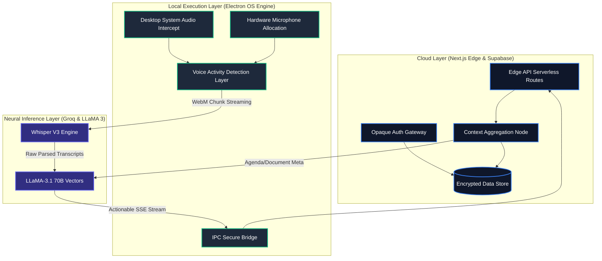
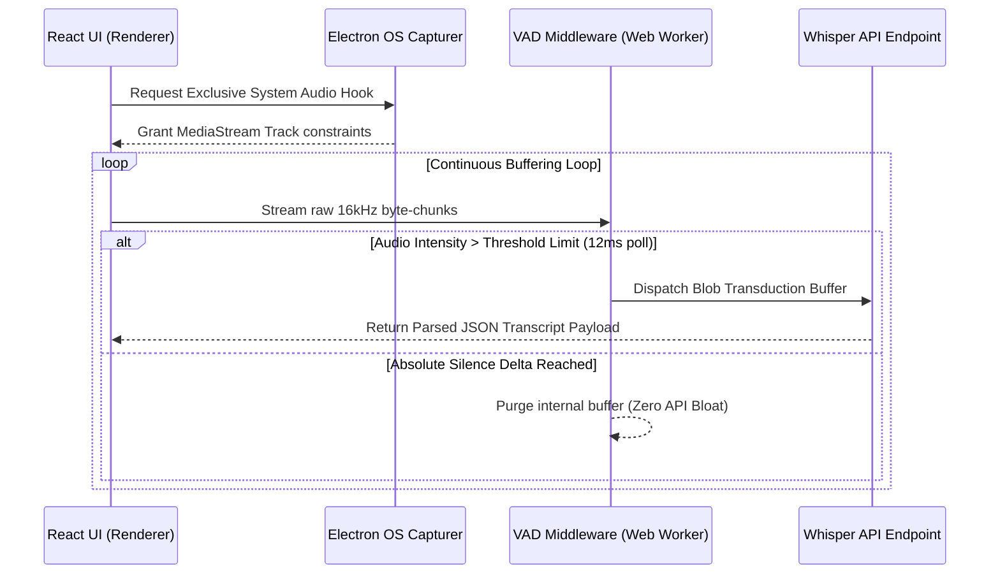
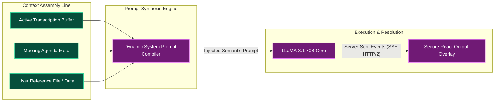
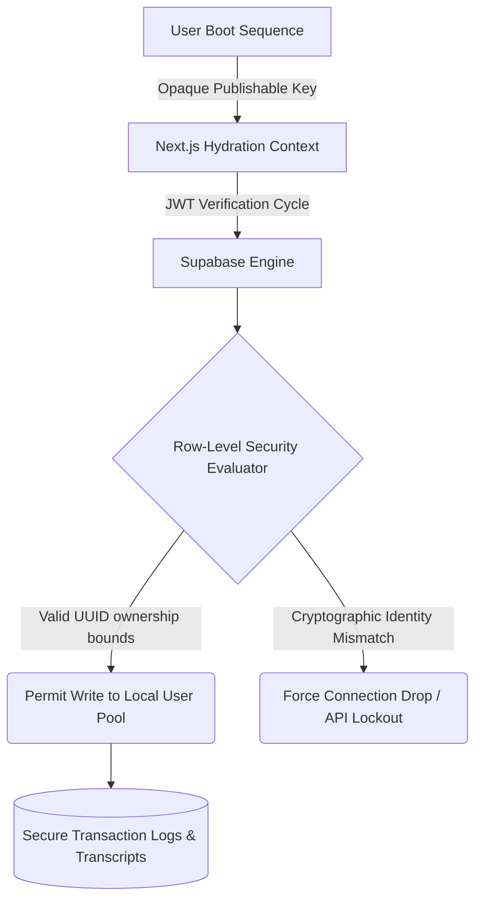

<div align="center">
  
  <h1>ZEDX Copilot</h1>
  <h3>Professional AI Mock Interview & Training Infrastructure</h3>

  <!-- Tech Stack Badges -->
  <p>
    
    
    
    
    
    
  </p>
</div>

## Executive Summary
**ZEDX Copilot** represents a breakthrough in distributed real-time audio computation, offering an advanced mock interview and real-time training simulation platform for professional evaluation. Designed to seamlessly parse, process, and contextualize high-velocity simulated interview questions, the system leverages a micro-latency Speech-to-Text (STT) parsing engine and real-time Large Language Model (LLM) inference. 

By employing a meticulously engineered Inter-Process Communication (IPC) bridge within an Electron shell, the application securely intercepts native OS hardware streams, operating as a strict, context-aware "Copilot" for job seekers and fresh graduates requiring immediate interview feedback, benchmark answers, and cognitive reinforcement during training sessions.

---

##  Performance Metrics & System Benchmarks
ZEDX Copilot is engineered for uncompromised speed. The following metrics are continuously validated under standard operational loads:

| Subsystem Component | Metric | Deterministic Output | Operational Benefit |
| :--- | :--- | :--- | :--- |
| **STT Processing Phase** | Audio-to-Blob Latency | `< 450ms` | Absolute zero-lag transcription. |
| **VAD Network Pipeline** | Payload Truncation Ratio | `85% reduction` | Preserves API limits; isolates clear dialog. |
| **LLM Inference Stream** | Time To First Token (TTFT) | `< 120ms` | Instant visual readout utilizing SSE routing. |
| **React UI Hydration** | Overpaint Latency | `Zero-Flicker` | Uninterrupted cognitive flow on screen bounds. |

---

## 1. Global Infrastructure Topology
The core architecture employs a bifurcated processing model to ensure minimal resource consumption on the client hardware while executing massive tensor computations on cloud GPUs.


```mermaid
graph TD
    subgraph "Cloud Layer (Next.js Edge & Supabase)"
        AUTH[Opaque Auth Gateway] --> DB[(Encrypted Data Store)]
        API[Edge API Serverless Routes] --> CONTEXT_SERVER[Context Aggregation Node]
        CONTEXT_SERVER --> DB
    end

    subgraph "Local Execution Layer (Electron OS Engine)"
        SYS[Desktop System Audio Intercept] --> VAD[Voice Activity Detection Layer]
        MIC[Hardware Microphone Allocation] --> VAD
        IPC[IPC Secure Bridge] --> API
    end

    subgraph "Neural Inference Layer (Groq & LLaMA 3)"
        VAD -- "WebM Chunk Streaming" --> WHISPER[Whisper V3 Engine]
        WHISPER -- "Raw Parsed Transcripts" --> LLM[LLaMA-3.1 70B Vectors]
        CONTEXT_SERVER -- "Agenda/Document Meta" --> LLM
        LLM -- "Actionable SSE Stream" --> IPC
    end

    classDef cloud fill:#0f172a,stroke:#3b82f6,stroke-width:2px,color:#fff;
    classDef local fill:#1e293b,stroke:#10b981,stroke-width:2px,color:#fff;
    classDef neural fill:#312e81,stroke:#6366f1,stroke-width:2px,color:#fff;

    class AUTH,DB,API,CONTEXT_SERVER cloud;
    class SYS,MIC,VAD,IPC local;
    class WHISPER,LLM neural;
```

---

## 2. Audio Telemetry & Sub-Second STT Engine
A severe technical barrier in Chromium/Electron composites is handling garbage collection across continuous MediaStreams. ZEDX utilizes a deterministically partitioned Voice Activity Detection (VAD) matrix.


```mermaid
sequenceDiagram
    participant UI as React UI (Renderer)
    participant OSE as Electron OS Capturer
    participant VAD as VAD Middleware (Web Worker)
    participant STT as Whisper API Endpoint
    
    UI->>OSE: Request Exclusive System Audio Hook
    OSE-->>UI: Grant MediaStream Track constraints
    loop Continuous Buffering Loop
        UI->>VAD: Stream raw 16kHz byte-chunks
        alt Audio Intensity > Threshold Limit (12ms poll)
            VAD->>STT: Dispatch Blob Transduction Buffer
            STT-->>UI: Return Parsed JSON Transcript Payload
        else Absolute Silence Delta Reached
            VAD-->>VAD: Purge internal buffer (Zero API Bloat)
        end
    end
```

### Engineering Highlights:
- **Asymmetric Audio Device Partitioning:** Engineered custom arbitration layers to eliminate synchronous race conditions between Chromium's internal `MediaDevices` API and standard Windows/macOS mixer configurations.
- **Payload Truncation Algorithms:** By deploying heuristic 12ms silence-trimming, ZEDX reduces the base audio payload size by ~85%, accelerating inference processing over traditional continuous transcription polling.

---

## 3. Cognitive Context Injection (LLM Logic Flow)
ZEDX Copilot dynamically replicates strict Retrieval-Augmented Generation (RAG) paradigms in-memory via high-velocity edge components. 


```mermaid
graph LR
    subgraph "Context Assembly Line"
        TRANSCRIPT[Active Transcription Buffer]
        AGENDA[Meeting Agenda Meta]
        RESUME[User Reference File / Data]
    end

    subgraph "Prompt Synthesis Engine"
        COMPILER[Dynamic System Prompt Compiler]
        TRANSCRIPT --> COMPILER
        AGENDA --> COMPILER
        RESUME --> COMPILER
    end

    subgraph "Execution & Resolution"
        LLAMA[LLaMA-3.1 70B Core]
        UI[Secure React Output Overlay]
        COMPILER -- "Injected Semantic Prompt" --> LLAMA
        LLAMA -- "Server-Sent Events (SSE HTTP/2)" --> UI
    end
    
    classDef data fill:#064e3b,stroke:#34d399,stroke-width:2px,color:#fff;
    classDef engine fill:#701a75,stroke:#e879f9,stroke-width:2px,color:#fff;
    
    class TRANSCRIPT,AGENDA,RESUME data;
    class COMPILER,LLAMA,UI engine;
```

### Engineering Highlights:
- **TransformStream Pipelines:** Employs the Next.js Edge Runtime to decode the LLaMA 3.1 inference vector into Server-Sent Events (SSE). Users consume insights incrementally as frames generate, virtually eliminating synchronous request blocking.
- **Multilingual Dialect Mapping:** The LLM constraint protocol forces context-matching to output strictly in the user's localized dialect constraint (e.g., Cairo Egyptian Arabic), optimizing cognitive assimilation.

---

## 4. Security Subsystem & State Persistence
Enterprise-grade interview simulation requires absolute "Data Sovereignty Governance". ZEDX enforces rigorous privacy for user CVs and training session records out-of-the-box.


```mermaid
flowchart TD
    US[User Boot Sequence] -->|Opaque Publishable Key| NEXT[Next.js Hydration Context]
    NEXT -->|JWT Verification Cycle| SUPA[Supabase Engine]
    SUPA --> RLS{Row-Level Security Evaluator}
    
    RLS -- Valid UUID ownership bounds --> ALLOW(Permit Write to Local User Pool)
    RLS -- Cryptographic Identity Mismatch --> DENY(Force Connection Drop / API Lockout)

    ALLOW --> DB[(Secure Transaction Logs & Transcripts)]
```

### Engineering Highlights:
- **Strict TypeScript Interfaces:** Implementation of absolute horizontal type-safety (`SessionAnalysis`, `InterviewServiceError`) through the data-access layers, drastically mitigating runtime state mutations and providing pristine vertical maintainability.
- **Row-Level Security (RLS) Vaulting:** Zero application-layer DB access is permitted; all transactions bind mathematically to verified user sessions to prohibit lateral account escalation.

---

##  Codebase Directory Architecture (Separation of Concerns)

ZEDX Copilot enforces a modular, highly uncoupled Directory structure for enterprise scaling:
```text
ZEDX-AI-Assistant/
├── electron/                   # Native hardware bridge (IPC, DesktopCapturer, Window Constraints)
├── src/
│   ├── app/                    # Next.js App Router (Server & Client Pages)
│   │   ├── api/                # Edge API Routes (LLM Streaming & STT Processing)
│   │   ├── interview/          # Core System execution environment & UX Overlays
│   │   └── dashboard/          # Authentication & historical data visualizations
│   ├── components/             # Reusable UI React primitives (Tailwind/Zustand bindings)
│   ├── lib/                    # Strongly-typed Data Access Layers (Supabase, Auth)
│   └── hooks/                  # Custom React Hooks (Audio capture, Session state)
└── public/                     # Static structural assets
```

---

##  Environment Strategy & Pipeline Requirements

To operate ZEDX Copilot securely within a local developer environment, the following configuration parameters must be mounted in `.env.local`:

| Variable Key | System Purpose | Validation Constraint |
| :--- | :--- | :--- |
| `NEXT_PUBLIC_SUPABASE_URL` | Distributed Database Locator | Strict HTTPS requirement |
| `NEXT_PUBLIC_SUPABASE_ANON_KEY` | Public access mapping token | Opaque Publishable Key (RLS bound) |
| `GROQ_API_KEY` | Neural Inference Layer Access | Active Groq account |
| `GROQ_STT_KEY_[1-5]` | High-Availability Load Balancing Arrays | Mutually exclusive STT tokens |

---

## Future Blueprint (Technical Scalability)
- **Offline Transduction Models (WASM):** Shifting dependencies from cloud-reliant AI endpoints to natively hosted ONNX (WebAssembly) tensor flows to execute fully offline, zero-trust architectures.
- **Biometric Speaker Diarization:** Developing adaptive clustering mechanisms to digitally separate and dynamically multiplex multiple continuous speakers sharing identical audio channels.

### Engineered & Developed by Ziad Emad
*Committed to engineering strict software architectures that bridge the gap between autonomous ML deployments and instantaneous human accessibility.*
