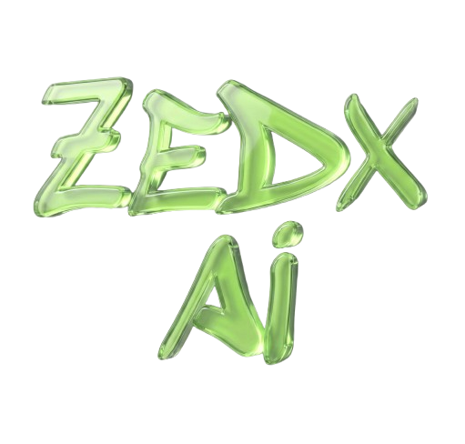
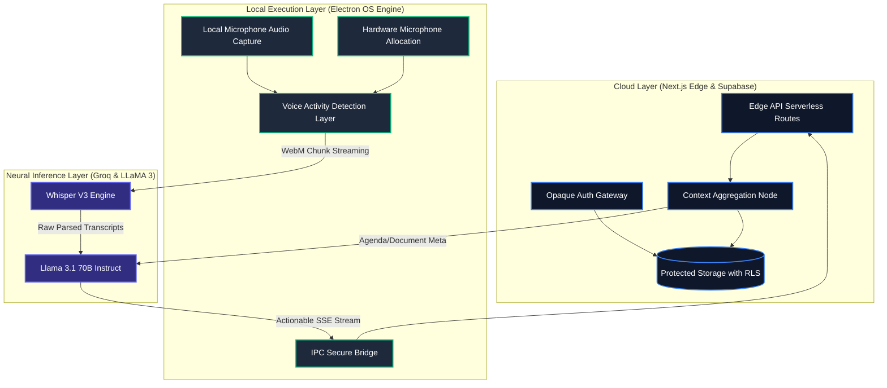
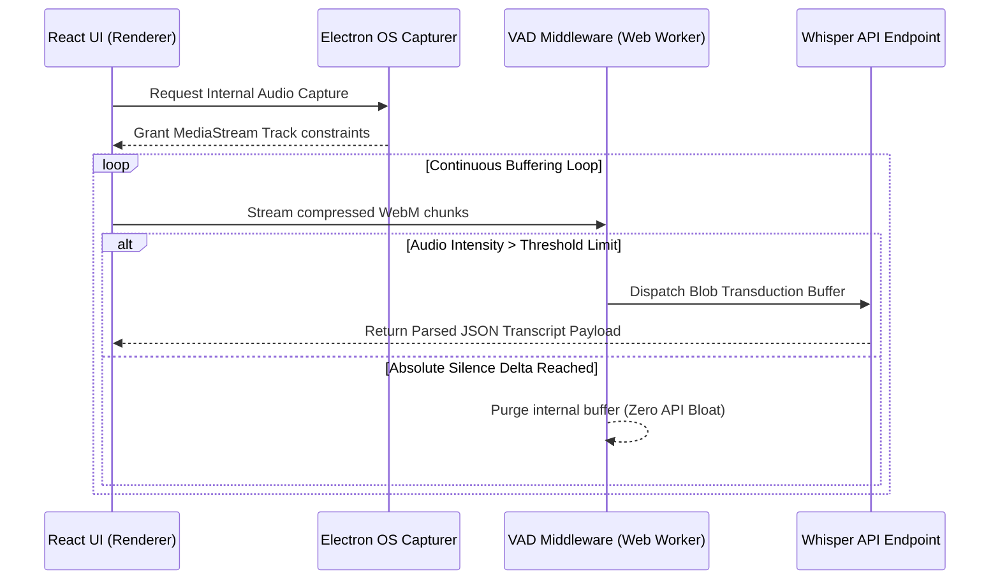
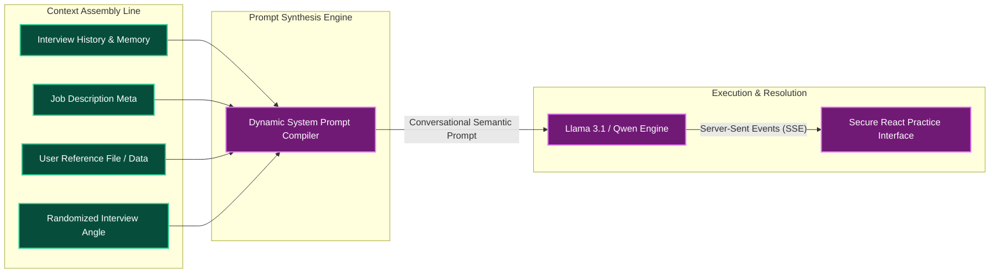
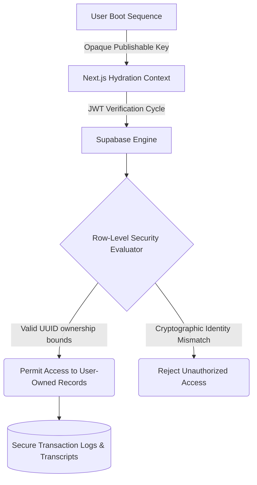

<div align="center">
  
  <h1>ZEDX AI Simulator</h1>
  <h3>Professional AI Interview Simulation & Training Infrastructure</h3>

  <!-- Tech Stack Badges -->
  <p>
    
    
    
    
    
    
  </p>
</div>

## Executive Summary
**ZEDX AI Simulator** is a dedicated interview simulation and training platform designed for professional evaluation. Originally built as an Electron desktop app, ZEDX has evolved into a comprehensive **Dual-Mode** platform (Web & Desktop) that utilizes advanced Speech-to-Text (STT), Large Language Model (LLM) inference, and highly-optimized Text-to-Speech (TTS) engines.

ZEDX bridges the gap between preparation and execution by offering two distinct tools:
1. **The Web Simulator (Rigorous Testing):** Designed for advanced candidates who want a strict, realistic interview environment. An autonomous, highly intelligent Voice-to-Voice AI Agent conducts mock interviews in **30+ supported languages**. It acts as a true conversational partner, dynamically generating deep, probing questions to ensure no two interviews are the same. No hints, no help—just you and the AI evaluating your every word.
2. **The Desktop Sandbox (Assisted Learning):** Designed for skill improvement. This is a dedicated Windows environment where the AI acts as your copilot. Utilizing **Internal Audio Routing** and **Screen Capture (OCR)**, the AI analyzes your shared screen and provides suggested answers in real-time, helping you build confidence and improve your technical interview skills before entering the rigorous Web Simulator.

---

## 🔥 Key Platform Updates & Features

- **Advanced Performance Scorecard**: A comprehensive post-interview AI analysis evaluating Technical Accuracy, Communication Skills, and Overall Performance, providing actionable insights based on ideal industry benchmarks.
- **Organized PDF Export**: Ability to instantly export the interview scorecard into a clean, geometric, and printable PDF document.
- **Custom Interview Limits**: Configurable mock interviews allowing between 5 to 40 questions per session to accommodate various testing endurances.
- **Dynamic Light & Dark Modes**: Fully optimized, premium aesthetic spanning both light and dark themes with hardware-accelerated fluid animations.

---

## Why ZEDX?

| Traditional Interview Prep | ZEDX AI Simulator |
| :--- | :--- |
| Read static sample questions | Simulate realistic dynamic interviews |
| Receive generic advice | Get context-aware, resume-tailored feedback |
| Practice repeatedly without measurement | Track performance and measure improvement |
| Rely completely on AI | **Independent Mode** verifies actual learning |

**The Independent Mode Advantage:**
ZEDX is not designed to create AI dependency. We utilize AI during training sessions, then remove the assistance to measure whether the candidate has actually improved. This ensures candidates are truly prepared for real-world scenarios.

---

## Performance Metrics & System Benchmarks
ZEDX AI Simulator is engineered for uncompromised speed during practice sessions. The following metrics represent typical performance under standard operational loads:

| Subsystem Component | Metric | Observed Output | Operational Benefit |
| :--- | :--- | :--- | :--- |
| **STT Processing Phase** | Audio-to-Blob Latency | `Near-real-time` | Fast transcription for fluid simulation. |
| **VAD Network Pipeline** | Payload Truncation Ratio | `~85% reduction` | Preserves API limits; isolates clear dialog. |
| **LLM Inference Stream** | Time To First Token (TTFT) | `~120ms (observed under optimized network conditions)` | Fast visual readout utilizing SSE routing. |
| **React UI Hydration** | UI Rendering | `Stable Streaming Render` | Smooth incremental feedback display. |

---

## 1. Global Infrastructure Topology
The core architecture employs a bifurcated processing model to ensure minimal resource consumption on the client hardware while executing LLM computations on cloud GPUs.


```mermaid
graph TD
    subgraph "Cloud Layer (Next.js Edge & Supabase)"
        AUTH[Opaque Auth Gateway] --> DB[(Protected Storage with RLS)]
        API[Edge API Serverless Routes] --> CONTEXT_SERVER[Context Aggregation Node]
        CONTEXT_SERVER --> DB
    end

    subgraph "Local Execution Layer (Electron OS Engine)"
        SYS[Local Microphone Audio Capture] --> VAD[Voice Activity Detection Layer]
        MIC[Hardware Microphone Allocation] --> VAD
        IPC[IPC Secure Bridge] --> API
    end

    subgraph "Neural Inference Layer (Groq & LLaMA 3)"
        VAD -- "WebM Chunk Streaming" --> WHISPER[Whisper V3 Engine]
        WHISPER -- "Raw Parsed Transcripts" --> LLM[Llama 3.1 70B Instruct]
        CONTEXT_SERVER -- "Agenda/Document Meta" --> LLM
        LLM -- "Actionable SSE Stream" --> IPC
    end

    classDef cloud fill:#0f172a,stroke:#3b82f6,stroke-width:2px,color:#fff;
    classDef local fill:#1e293b,stroke:#10b981,stroke-width:2px,color:#fff;
    classDef neural fill:#312e81,stroke:#6366f1,stroke-width:2px,color:#fff;

    class AUTH,DB,API,CONTEXT_SERVER cloud;
    class SYS,MIC,VAD,IPC local;
    class WHISPER,LLM neural;
```

---

## 2. Audio Telemetry & Sub-Second STT Engine
A severe technical barrier in Chromium/Electron composites is handling garbage collection across continuous MediaStreams. ZEDX uses a lightweight Voice Activity Detection (VAD) pipeline to identify active speech and minimize unnecessary audio transmission.


```mermaid
sequenceDiagram
    participant UI as React UI (Renderer)
    participant OSE as Electron OS Capturer
    participant VAD as VAD Middleware (Web Worker)
    participant STT as Whisper API Endpoint
    
    UI->>OSE: Request Internal Audio Capture
    OSE-->>UI: Grant MediaStream Track constraints
    loop Continuous Buffering Loop
        UI->>VAD: Stream compressed WebM chunks
        alt Audio Intensity > Threshold Limit
            VAD->>STT: Dispatch Blob Transduction Buffer
            STT-->>UI: Return Parsed JSON Transcript Payload
        else Absolute Silence Delta Reached
            VAD-->>VAD: Purge internal buffer (Zero API Bloat)
        end
    end
```

### Engineering Highlights:
- **Asymmetric Audio Device Partitioning:** Engineered custom arbitration layers to eliminate synchronous race conditions between Chromium's internal `MediaDevices` API and standard Windows/macOS mixer configurations.
- **Heuristic VAD Filtering:** ZEDX reduces unnecessary audio payloads by approximately 85% in typical practice sessions, based on internal measurements. This accelerates inference processing over traditional continuous transcription polling.

---

## 3. Cognitive Context Injection (The Smart AI Interviewer)
ZEDX AI Simulator dynamically replicates strict Dynamic Context Injection paradigms in-memory via high-velocity edge components. The system cures "LLM Amnesia" by injecting memory payloads and dynamic conversation angles to simulate a highly intelligent human interviewer.


```mermaid
graph LR
    subgraph "Context Assembly Line"
        HISTORY[Interview History & Memory]
        JD[Job Description Meta]
        RESUME[User Reference File / Data]
        ANGLE[Randomized Interview Angle]
    end

    subgraph "Prompt Synthesis Engine"
        COMPILER[Dynamic System Prompt Compiler]
        HISTORY --> COMPILER
        JD --> COMPILER
        RESUME --> COMPILER
        ANGLE --> COMPILER
    end

    subgraph "Execution & Resolution"
        LLAMA[Llama 3.1 / Qwen Engine]
        UI[Secure React Practice Interface]
        COMPILER -- "Conversational Semantic Prompt" --> LLAMA
        LLAMA -- "Server-Sent Events (SSE)" --> UI
    end
    
    classDef data fill:#064e3b,stroke:#34d399,stroke-width:2px,color:#fff;
    classDef engine fill:#701a75,stroke:#e879f9,stroke-width:2px,color:#fff;
    
    class HISTORY,JD,RESUME,ANGLE data;
    class COMPILER,LLAMA,UI engine;
```

### Advanced AI Capabilities:
- **Conversational Adaptability:** The AI does not read from a static script. It is engineered to analyze the candidate's previous response in real-time, crafting highly specific follow-up questions that probe deeper into weak answers or smoothly transition topics when a point is proven.
- **Memory Injection:** The system inherently tracks all previously asked questions and injects them as a negative constraint boundary during prompt synthesis, guaranteeing that no two questions are ever repeated and eliminating standard LLM predictability.
- **True Multilingual Native Fluidity:** Supporting exactly **29 major languages**, the system routes raw ISO-639-1 BCP-47 tags directly to Whisper for maximum transcription accuracy, while standardizing TTS outputs via ElevenLabs `multilingual_v2` for hyper-realistic native accents.
- **TransformStream Pipelines:** Employs the Next.js Edge Runtime to decode the streamed LLM inference response into Server-Sent Events (SSE). Users consume insights incrementally as frames generate, virtually eliminating synchronous request blocking.

---

## 4. Security Subsystem & State Persistence
Privacy-focused interview simulation requires secure handling of user CVs and training session data. ZEDX enforces rigorous privacy out-of-the-box.


```mermaid
flowchart TD
    US[User Boot Sequence] -->|Opaque Publishable Key| NEXT[Next.js Hydration Context]
    NEXT -->|JWT Verification Cycle| SUPA[Supabase Engine]
    SUPA --> RLS{Row-Level Security Evaluator}
    
    RLS -- Valid UUID ownership bounds --> ALLOW(Permit Access to User-Owned Records)
    RLS -- Cryptographic Identity Mismatch --> DENY(Reject Unauthorized Access)

    ALLOW --> DB[(Secure Transaction Logs & Transcripts)]
```

### Engineering Highlights:
- **Strict TypeScript Interfaces:** Implementation of absolute horizontal type-safety (`SessionAnalysis`, `InterviewServiceError`) through the data-access layers, drastically mitigating runtime state mutations and providing pristine vertical maintainability.
- **Row-Level Security (RLS) Vaulting:** Users cannot directly access other users' rows; all transactions bind mathematically to verified user sessions to prohibit lateral account escalation.

---

## Codebase Directory Architecture (Separation of Concerns)

ZEDX AI Simulator enforces a modular, highly uncoupled Directory structure for enterprise scaling:
```text
ZEDX-AI-Simulator/
├── electron/                   # Native hardware bridge (IPC, DesktopCapturer, Window Constraints)
├── src/
│   ├── app/                    # Next.js App Router (Server & Client Pages)
│   │   ├── api/                # Edge API Routes (LLM Streaming & STT Processing)
│   │   ├── interview/          # Core System execution environment & Practice Interfaces
│   │   └── dashboard/          # Authentication & historical data visualizations
│   ├── components/             # Reusable UI React primitives (Tailwind/Zustand bindings)
│   ├── lib/                    # Strongly-typed Data Access Layers (Supabase, Auth)
│   └── hooks/                  # Custom React Hooks (Audio capture, Session state)
└── public/                     # Static structural assets
```

---

## Environment Strategy & Pipeline Requirements

To operate ZEDX AI Simulator securely within a local developer environment, the following configuration parameters must be mounted in `.env.local`:

| Variable Key | System Purpose | Validation Constraint |
| :--- | :--- | :--- |
| `NEXT_PUBLIC_SUPABASE_URL` | Distributed Database Locator | Strict HTTPS requirement |
| `NEXT_PUBLIC_SUPABASE_ANON_KEY` | Public access mapping token | Opaque Publishable Key (RLS bound) |
| `GROQ_API_KEY` | Neural Inference Layer Access | Active Groq account |
| `GROQ_STT_KEY_[1-5]` | High-Availability Load Balancing Arrays | Mutually exclusive STT tokens |

---

## Future Blueprint (Technical Scalability)
- **Offline Transduction Models (WASM):** Shifting dependencies from cloud-reliant AI endpoints to natively hosted ONNX (WebAssembly) tensor flows to execute fully offline, zero-trust architectures.
- **Biometric Speaker Diarization:** Developing adaptive clustering mechanisms to digitally separate and dynamically multiplex multiple continuous speakers sharing identical audio channels.

### Engineered & Developed by Ziad Emad
*Committed to engineering strict software architectures that bridge the gap between autonomous ML deployments and instantaneous human accessibility.*
