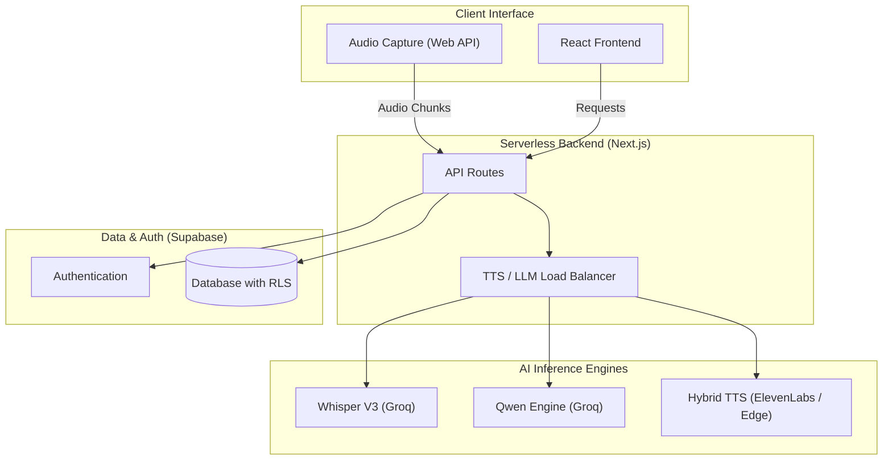
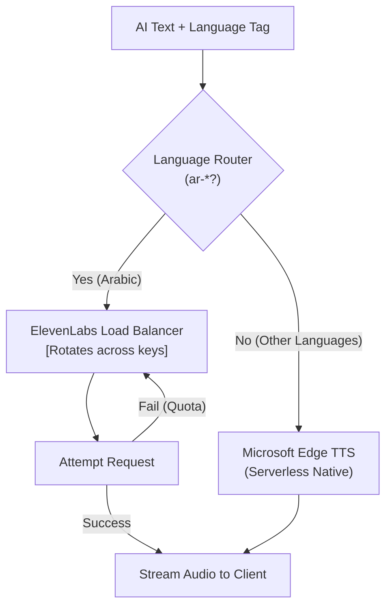
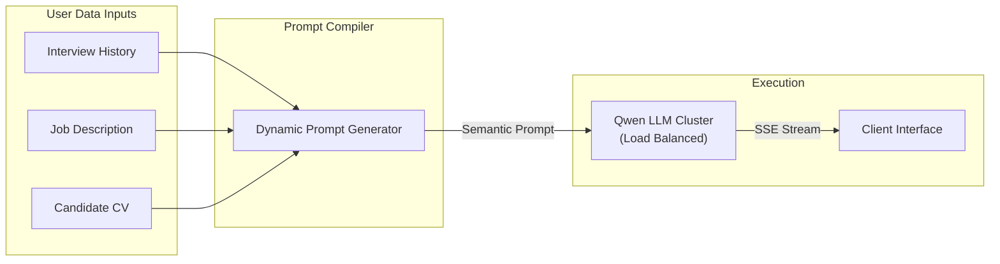
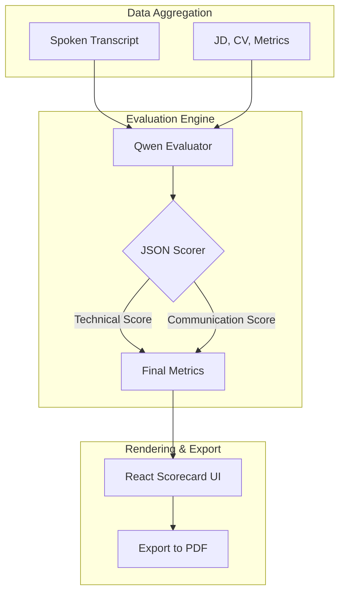

  
  <h1>ZEDX AI Simulator</h1>
  <h3>Professional AI Interview Simulation & Training Infrastructure</h3>

  <!-- Tech Stack Badges -->
  

    
    
    
    
    
    
  

## Executive Summary

**ZEDX AI Simulator** is a professional interview simulation and training platform engineered for rigorous candidate evaluation. 
ZEDX provides a highly responsive Voice-to-Voice AI Agent that conducts structured mock interviews in **30+ languages**. The agent dynamically generates contextually-aware probing questions derived from the candidate's actual CV and target Job Description (JD).

---

## Core Capabilities

- **Hybrid TTS Engine:** Dynamic language-aware routing to the optimal speech synthesis provider per request (ElevenLabs for Arabic, Edge TTS for others), fully optimized for Serverless Edge environments.
- **Fault-Tolerant Inference Pipeline:** Distributed, load-balanced key rotation across the LLM and TTS layers. Any quota event triggers a transparent failover to the next available endpoint.
- **Full-Document Context Injection:** Untruncated CV and Job Description content is passed to the LLM in its entirety for highly personalized and accurate interviews.
- **Multilingual Support:** Seamless 30+ language support spanning across Speech-to-Text (STT), AI Generation, and Text-to-Speech (TTS).

---

## 1. Global Infrastructure Topology

```mermaid
graph TD
    subgraph Client ["Client Interface"]
        UI["React Frontend"] 
        MIC["Audio Capture (Web API)"] 
    end

    subgraph Backend ["Serverless Backend (Next.js)"]
        API["API Routes"] 
        ROUTER["TTS / LLM Load Balancer"]
    end

    subgraph CloudLayer ["Data & Auth (Supabase)"]
        AUTH["Authentication"] 
        DB[("Database with RLS")]
    end

    subgraph AI_Engines ["AI Inference Engines"]
        STT["Whisper V3 (Groq)"]
        LLM["Qwen Engine (Groq)"]
        TTS["Hybrid TTS (ElevenLabs / Edge)"]
    end

    MIC -->|Audio Chunks| API
    UI -->|Requests| API
    API --> ROUTER
    ROUTER --> STT
    ROUTER --> LLM
    ROUTER --> TTS
    API --> AUTH
    API --> DB
```

---

## 2. Dynamic TTS Routing & Load Balancing

```mermaid
flowchart TD
    INPUT["AI Text + Language Tag"] --> ROUTER{"Language Router\n(ar-*?)"}

    ROUTER -- "Yes (Arabic)" --> ELEVEN_POOL["ElevenLabs Load Balancer\n[Rotates across keys]"]
    ROUTER -- "No (Other Languages)" --> EDGE_PROC["Microsoft Edge TTS\n(Serverless Native)"]

    ELEVEN_POOL --> TRY_KEY["Attempt Request"]
    TRY_KEY -- "Success" --> STREAM["Stream Audio to Client"]
    TRY_KEY -- "Fail (Quota)" --> ELEVEN_POOL

    EDGE_PROC --> STREAM
```

---

## 3. Cognitive Context Injection

```mermaid
graph LR
    subgraph DataInputs ["User Data Inputs"]
        HISTORY["Interview History"]
        JD["Job Description"]
        RESUME["Candidate CV"]
    end

    subgraph AI_Compiler ["Prompt Compiler"]
        COMPILER["Dynamic Prompt Generator"]
        HISTORY --> COMPILER
        JD --> COMPILER
        RESUME --> COMPILER
    end

    subgraph Execution ["Execution"]
        LLM["Qwen LLM Cluster\n(Load Balanced)"]
        COMPILER -- "Semantic Prompt" --> LLM
        LLM -- "SSE Stream" --> UI["Client Interface"]
    end
```

---

## 4. Post-Interview Performance Scorecard

```mermaid
graph TD
    subgraph Aggregation ["Data Aggregation"]
        TRANSCRIPT["Spoken Transcript"]
        METADATA["JD, CV, Metrics"]
    end

    subgraph Evaluation ["Evaluation Engine"]
        GROQ["Qwen Evaluator"]
        TRANSCRIPT --> GROQ
        METADATA --> GROQ
        GROQ --> ANALYSIS{"JSON Scorer"}
        ANALYSIS -- "Technical Score" --> METRICS["Final Metrics"]
        ANALYSIS -- "Communication Score" --> METRICS
    end

    subgraph Export ["Rendering & Export"]
        METRICS --> SCORECARD["React Scorecard UI"]
        SCORECARD --> PDF["Export to PDF"]
    end
```

---

## Security & State Persistence

- **AI Prompt Guard:** Prevents malicious actors from embedding hidden instructions within PDF resumes.
- **Strict TypeScript Interfaces:** Type-safety across data-access layers mitigates runtime state mutations.
- **Row-Level Security (RLS):** PostgreSQL policies bind all data mathematically to verified user sessions.
- **API Key Vaulting:** All keys reside exclusively in server-side environment variables, enabling zero client-side exposure. Multiple keys are used in a dynamic array for automated load balancing.

---

### Engineered & Developed by Ziad Emad
*Committed to engineering scalable software architectures that bridge the gap between autonomous ML deployments and intuitive human accessibility.*
