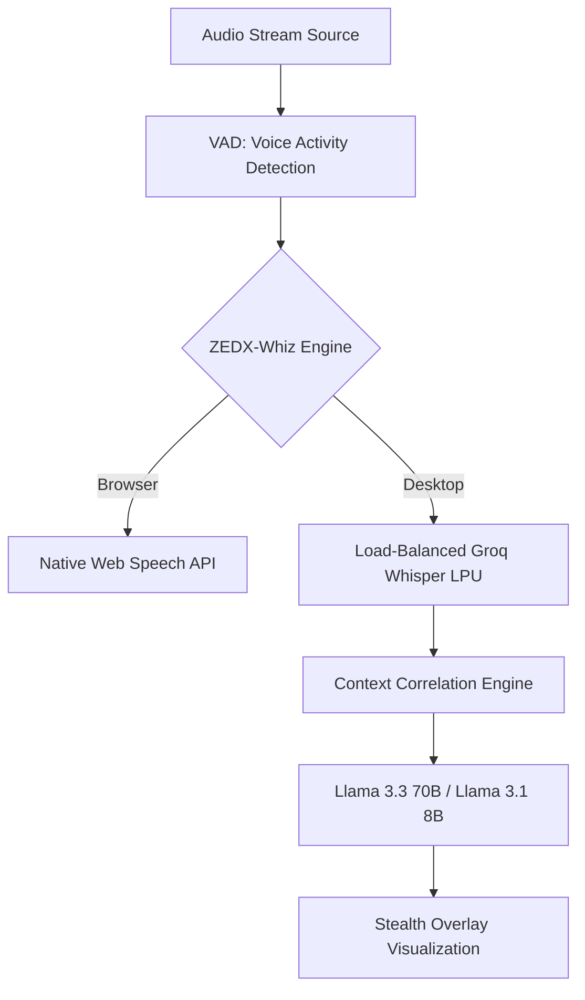

# ZEDX-AI: Professional Intelligence Systems
<div align="center">
  
  <p><strong>The Ultimate AI Interview Assistant for Real-Time Technical & Behavioral Guidance</strong></p>
  
  [](https://zedx-ai-assistant-1.vercel.app)
  [](https://github.com/ziademad02153/ZEDX-AI-Assistant/releases)
  [](LICENSE)
</div>

---

## 🚀 Overview

**ZEDX-AI** is a high-fidelity intelligence platform engineered for real-time career augmentation. By integrating advanced neural processing with a low-level system overlay, ZEDX-AI provides a seamless, context-aware experience that empowers professionals during critical technical and behavioral evaluations.

### Key Value Propositions
- **Precision Intelligence**: Powered by Llama 3.3 70B and Specialized Technical Models.
- **Sub-Second Latency**: Optimized for real-time verbal interactions.
- **Stealth Integration**: Invisible to all major monitoring and screen-sharing platforms.
- **Cross-Platform DNA**: High-performance Web and Desktop implementation.

---

## 🏗️ Technical Architecture

ZEDX-AI utilizes a sophisticated hybrid infrastructure, balancing client-side responsiveness with professional-grade cloud intelligence.

### Neural Processing Pipeline

```mermaid
graph TD
    A[Audio Stream Source] --> B[VAD: Voice Activity Detection]
    B --> C{ZEDX-Whiz Engine}
    C -->|Browser| D[Native Web Speech API]
    C -->|Desktop| E[Load-Balanced Groq Whisper LPU]
    E --> F[Context Correlation Engine]
    F --> G[Llama 3.3 70B / Llama 3.1 8B]
    G --> H[Stealth Overlay Visualization]
```

### Infrastructure Stack
| Layer | technology | rationale |
| :--- | :--- | :--- |
| **Frontend** | Next.js 16 (Turbopack) | Optimized reactive architecture for high-density data. |
| **Runtime** | Electron 39 | Direct hardware-level listeners and system audio access. |
| **Inference** | Groq LPU Scaling | 5-key round-robin logic for sustained high-speed STT. |
| **Backend** | Supabase PostgreSQL | Military-grade RLS (Row Level Security) and encryption. |
| **Design** | Tailwind CSS 4.0 | Precision aesthetic control with Emerald/Deep-Zinc palette. |

---

## 💎 Core Capabilities

### 🛡️ Untraceable Stealth Overlay
The ZEDX-AI Desktop Console leverages a custom rendering strategy that ensures the intelligence overlay remains strictly local to the user's view, bypassing detection from screen-processing algorithms.

### 🎙️ ZEDX-Whiz Transcription
Our multi-engine STT approach handles both ambient mic input and internal system audio (System Out) with zero perceptible lag, ensuring the AI "hears" exactly what you hear.

### 🧠 Contextual Memory Engine
Integrates professional resumes and specific job descriptions to tailor every AI response to your unique background and the target role's requirements.

---

## 🛠️ Implementation & Setup

### For Professionals (Users)
1. **Binary Install**: Download the latest `.exe` from [Releases](https://github.com/ziademad02153/ZEDX-AI-Assistant/releases).
2. **Setup**: Load your professional resume and the target job description.
3. **Activation**: Toggle the Stealth Overlay using `Alt+Space` and begin your interview.

### For Developers (Engineers)
```bash
# Clone the repository
git clone https://github.com/ziademad02153/ZEDX-AI-Assistant.git

# Install dependencies
npm install

# Initialize local development environment
npm run dev

# Launch Desktop Console (Simultaneously)
npm run electron:dev
```

---

## 🔐 Security & Privacy
- **E2E Encryption**: All session data is encrypted at rest and in transit.
- **Local-First Audio**: Direct system audio capture never leaves your machine in raw format; only processed tokens are relayed for inference.
- **Zero-Storage Policy**: Sensitive interview data is cleared upon session termination.

---

<div align="center">
  <p><strong>Developed by Ziad Emad</strong></p>
  <p><em>Standardizing Excellence in Career Intelligence.</em></p>
</div>
