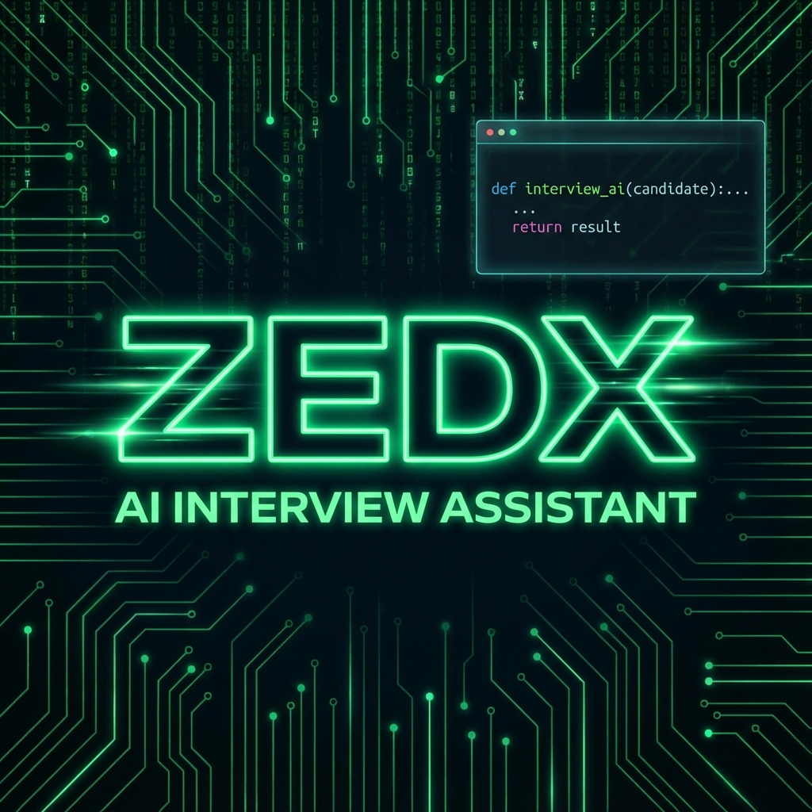

# ZEDX-AI: The Elite AI Interview Copilot

**Dominating job interviews with real-time, privacy-first AI intelligence.**

Live Website: [zedx-ai-assistant-1.vercel.app](https://zedx-ai-assistant-1.vercel.app)  
Desktop App: [Download for Windows](https://github.com/ziademad02153/ZEDX-AI-Assistant/releases/latest)

---

## The Ultimate Interview Advantage

ZEDX-AI is a professional-grade AI Interview Copilot engineered for clarity, speed, and absolute stealth. Unlike standard browser extensions, ZEDX-AI utilizes advanced hardware-level audio capture and an untraceable overlay system to provide real-time guidance during Zoom, Teams, and Google Meet interviews.

### Why ZEDX-AI?
- Professional-Grade Accuracy: Context-aware AI that reads your Resume and Job Description to generate tailored, high-impact responses.
- Ultra-Fast Inference: Powered by Groq LPU, delivering AI suggestions in under 500ms.
- Privacy-First Architecture: Your interview data stays yours. Encryption and Row-Level Security (RLS) ensure total isolation.

---

## Professional Desktop Features

The ZEDX-AI Desktop Application is where the true power lies, offering features impossible to achieve in a web browser:

### Stealth Overlay (Untraceable)
Run ZEDX-AI as a transparent, high-performance overlay that sits directly over your video conferencing app. It is 100% untraceable by screen-sharing software (Zoom/Teams), allowing you to receive guidance without detection.

### System Audio Capture
Capture crystal-clear interviewer audio directly from your system. Whether you're using headphones or speakers, ZEDX-AI hears what you hear, ensuring perfect transcription even in complex setups.

### Multi-Key High Availability
Our backend utilizes a sophisticated Multi-Key Load Balancing system (5x Groq Keys) to ensure zero downtime and sub-second transcription latency, even during peak usage.

### Auto-Update System
Stay on the cutting edge with our built-in auto-updater. The app seamlessly checks for and installs the latest optimizations and features from GitHub.

---

## Elite Tech Stack

- Framework: Next.js 16 + Electron 39
- Intelligence Engine: Groq LPU (Llama 3.3 70B, Llama 3.1 8B, Qwen 32B)
- Voice Control: Hybrid Web Speech API + High-Accuracy Server-Side Whisper (Groq)
- Neural VAD: Custom Voice Activity Detection to filter noise and silence.
- Secure Backend: Supabase with Row-Level Security (RLS)
- UI/UX: Tailored Cyberpunk Aesthetic with Tailwind CSS 4.0 and Framer Motion

---

## Getting Started

1. Download and Install: Grab the latest EXE from the Releases page.
2. Login: Seamlessly sync with your Google account via Supabase Auth.
3. Prepare: Upload your Resume and JD to the dashboard.
4. Activate: Launch the Stealth Overlay (Alt+Space) and dominate your interview.

---

**Engineering the future of employment interviews.**

Developed by Ziad Emad

