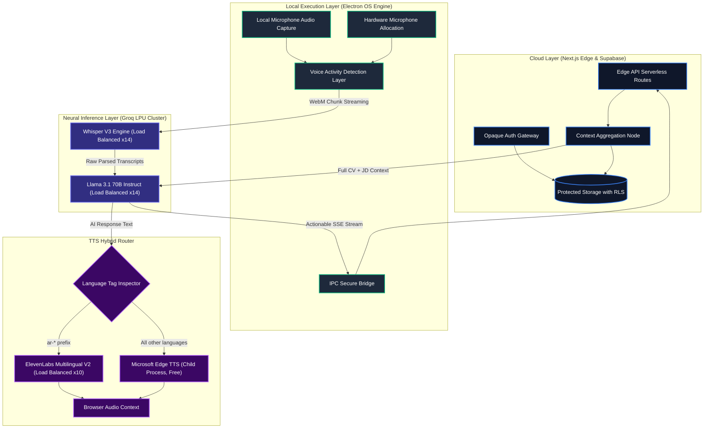
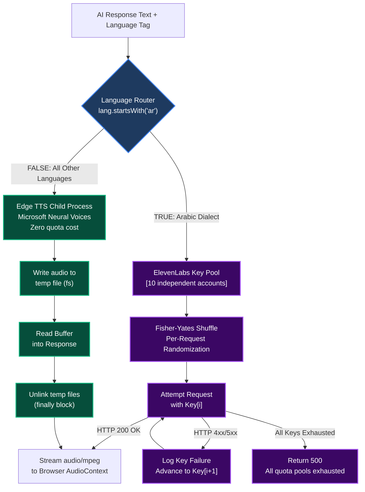
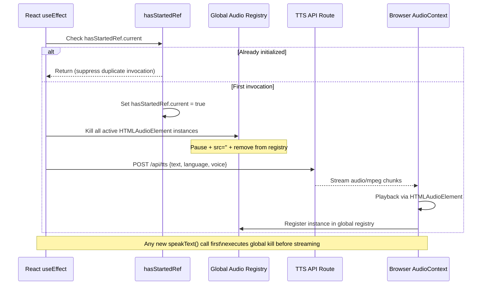
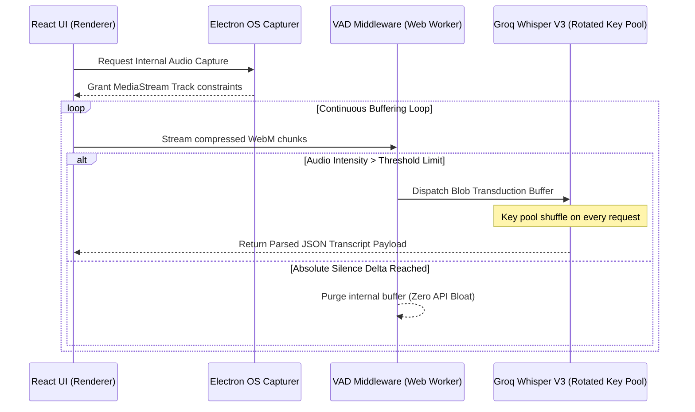
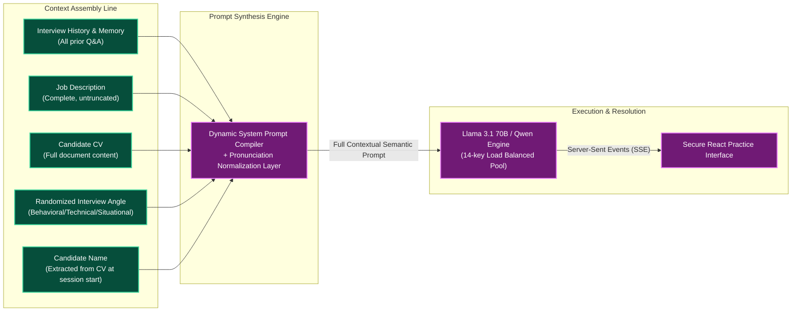
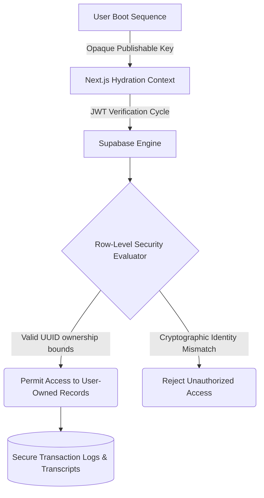
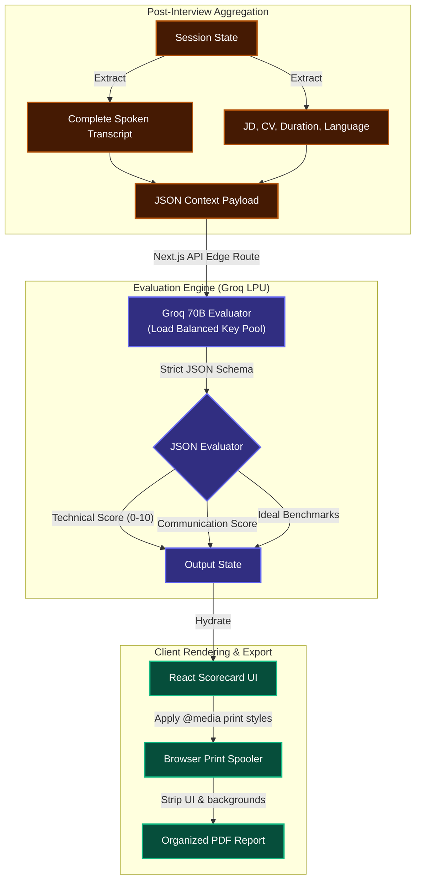
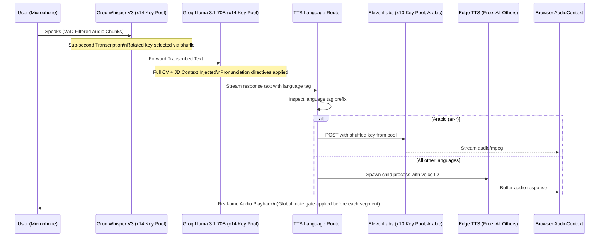

<div align="center">
  
  <h1>ZEDX AI Simulator</h1>
  <h3>Professional AI Interview Simulation & Training Infrastructure</h3>

  <!-- Tech Stack Badges -->
  <p>
    
    
    
    
    
    
    
  </p>
</div>

## Executive Summary

**ZEDX AI Simulator** is a professional interview simulation and training platform engineered for rigorous candidate evaluation. The platform has evolved from an Electron desktop application into a comprehensive **Dual-Mode** system (Web & Desktop) that integrates distributed Speech-to-Text (STT) pipelines, Large Language Model (LLM) inference with load-balanced key rotation, and a hybrid Text-to-Speech (TTS) engine that routes audio synthesis to the optimal provider based on language detection.

ZEDX operates across two distinct functional modes:

1. **The Web Simulator (Rigorous Evaluation Mode):** A strict, autonomous Voice-to-Voice AI Agent that conducts structured mock interviews in **30+ supported languages**. The agent dynamically generates contextually-aware probing questions derived from the candidate's actual CV and target job description. No assistance, no hints — a pure evaluation environment.

2. **The Desktop Sandbox (Assisted Learning Mode):** A Windows-native environment where the AI acts as a real-time copilot. Leveraging **Internal Audio Routing** and **Screen Capture (OCR)**, the AI analyzes the candidate's shared screen and delivers suggested responses mid-interview to accelerate skill acquisition.

---

---

## Latest Release Highlights

- **Hybrid TTS Engine:** Dynamic language-aware routing to the optimal speech synthesis provider per request, with automatic fallback handling and sub-millisecond routing decisions.
- **Fault-Tolerant Inference Pipeline:** Distributed, shuffle-based key rotation across the LLM and TTS layers. Any quota or rate-limit event triggers a seamless, transparent failover to the next available endpoint — zero user-facing downtime.
- **Unified Onboarding Flow:** Session initialization condensed into a single AI-generated, context-aware greeting derived directly from the candidate's CV — eliminating cold-start latency.
- **Full-Document Context Injection:** Untruncated CV and Job Description content is passed to the LLM in its entirety, ensuring no silent context loss on dense technical profiles.
- **Audio Concurrency Control:** Resolved race conditions causing audio overlap by implementing a global audio registry with an explicit mute gate and an initialization guard ref.


## Why ZEDX?

| Traditional Interview Prep | ZEDX AI Simulator |
| :--- | :--- |
| Read static sample questions | Simulate dynamic, CV-tailored interviews |
| Receive generic advice | Get context-aware, resume-calibrated feedback |
| Practice without measurable outcomes | Track performance metrics per session |
| Rely completely on AI assistance | Independent Mode validates genuine skill acquisition |

---

## Performance Metrics & System Benchmarks

| Subsystem Component | Metric | Observed Output | Operational Benefit |
| :--- | :--- | :--- | :--- |
| **STT Processing Phase** | Audio-to-Blob Latency | Near-real-time | Fluid transcription for continuous simulation |
| **VAD Network Pipeline** | Payload Truncation Ratio | ~85% reduction | Preserves API quota; isolates active speech |
| **LLM Inference Stream** | Time To First Token (TTFT) | ~120ms | Fast visual readout via SSE routing |
| **TTS Language Router** | Routing Decision Latency | Sub-millisecond | Language tag inspection is O(1) string prefix match |
| **Key Rotation Fallback** | Retry-to-Next-Key Latency | ~200-400ms | Transparent to user; no session interruption |

---

## 1. Global Infrastructure Topology


```mermaid
graph TD
    subgraph CloudLayer ["Cloud Layer (Next.js Edge & Supabase)"]
        AUTH["Opaque Auth Gateway"] --> DB[("Protected Storage with RLS")]
        API["Edge API Serverless Routes"] --> CONTEXT_SERVER["Context Aggregation Node"]
        CONTEXT_SERVER --> DB
    end

    subgraph LocalExecutionLayer ["Local Execution Layer (Electron OS Engine)"]
        SYS["Local Microphone Audio Capture"] --> VAD["Voice Activity Detection Layer"]
        MIC["Hardware Microphone Allocation"] --> VAD
        IPC["IPC Secure Bridge"] --> API
    end

    subgraph NeuralInferenceLayer ["Neural Inference Layer (Groq LPU Cluster)"]
        VAD -- "WebM Chunk Streaming" --> WHISPER["Whisper V3 Engine (Load Balanced x14)"]
        WHISPER -- "Raw Parsed Transcripts" --> LLM["Llama 3.1 70B Instruct (Load Balanced x14)"]
        CONTEXT_SERVER -- "Full CV + JD Context" --> LLM
        LLM -- "Actionable SSE Stream" --> IPC
    end

    subgraph TTSHybridLayer ["TTS Hybrid Router"]
        LLM -- "AI Response Text" --> LANG_DETECT{"Language Tag Inspector"}
        LANG_DETECT -- "ar-* prefix" --> ELEVEN["ElevenLabs Multilingual V2 (Load Balanced x10)"]
        LANG_DETECT -- "All other languages" --> EDGE["Microsoft Edge TTS (Child Process, Free)"]
        ELEVEN --> AUDIO_OUT["Browser Audio Context"]
        EDGE --> AUDIO_OUT
    end

    classDef cloud fill:#0f172a,stroke:#3b82f6,stroke-width:2px,color:#fff;
    classDef local fill:#1e293b,stroke:#10b981,stroke-width:2px,color:#fff;
    classDef neural fill:#312e81,stroke:#6366f1,stroke-width:2px,color:#fff;
    classDef tts fill:#3b0764,stroke:#a855f7,stroke-width:2px,color:#fff;

    class AUTH,DB,API,CONTEXT_SERVER cloud;
    class SYS,MIC,VAD,IPC local;
    class WHISPER,LLM neural;
    class LANG_DETECT,ELEVEN,EDGE,AUDIO_OUT tts;
```

---

## 2. TTS Hybrid Routing & Load Balancing Architecture


```mermaid
flowchart TD
    INPUT["AI Response Text + Language Tag"] --> ROUTER{"Language Router\n lang.startsWith('ar')"}

    ROUTER -- "TRUE: Arabic Dialect" --> ELEVEN_POOL["ElevenLabs Key Pool\n[10 independent accounts]"]
    ROUTER -- "FALSE: All Other Languages" --> EDGE_PROC["Edge TTS Child Process\nMicrosoft Neural Voices\nZero quota cost"]

    ELEVEN_POOL --> SHUFFLE["Fisher-Yates Shuffle\nPer-Request Randomization"]
    SHUFFLE --> TRY_KEY["Attempt Request\nwith Key[i]"]
    TRY_KEY -- "HTTP 200 OK" --> STREAM["Stream audio/mpeg\nto Browser AudioContext"]
    TRY_KEY -- "HTTP 4xx/5xx" --> LOG["Log Key Failure\nAdvance to Key[i+1]"]
    LOG --> TRY_KEY
    TRY_KEY -- "All Keys Exhausted" --> ERROR["Return 500\nAll quota pools exhausted"]

    EDGE_PROC --> TEMP_FILE["Write audio to\ntemp file (fs)"]
    TEMP_FILE --> READ_BUFFER["Read Buffer\ninto Response"]
    READ_BUFFER --> CLEANUP["Unlink temp files\n(finally block)"]
    CLEANUP --> STREAM

    classDef router fill:#1e3a5f,stroke:#3b82f6,stroke-width:2px,color:#fff;
    classDef eleven fill:#3b0764,stroke:#a855f7,stroke-width:2px,color:#fff;
    classDef edge fill:#064e3b,stroke:#10b981,stroke-width:2px,color:#fff;

    class ROUTER router;
    class ELEVEN_POOL,SHUFFLE,TRY_KEY,LOG,ERROR eleven;
    class EDGE_PROC,TEMP_FILE,READ_BUFFER,CLEANUP edge;
```

---

## 3. Audio Concurrency Control & Race Condition Elimination


```mermaid
sequenceDiagram
    participant REACT as React useEffect
    participant REF as hasStartedRef
    participant AUDIO as Global Audio Registry
    participant TTS as TTS API Route
    participant CTX as Browser AudioContext

    REACT->>REF: Check hasStartedRef.current
    alt Already initialized
        REF-->>REACT: Return (suppress duplicate invocation)
    else First invocation
        REF->>REF: Set hasStartedRef.current = true
        REACT->>AUDIO: Kill all active HTMLAudioElement instances
        Note over AUDIO: Pause + src='' + remove from registry
        REACT->>TTS: POST /api/tts {text, language, voice}
        TTS-->>CTX: Stream audio/mpeg chunks
        CTX->>CTX: Playback via HTMLAudioElement
        CTX->>AUDIO: Register instance in global registry
    end

    Note over REACT,CTX: Any new speakText() call first\nexecutes global kill before streaming
```

---

## 4. Audio Telemetry & Sub-Second STT Engine


```mermaid
sequenceDiagram
    participant UI as React UI (Renderer)
    participant OSE as Electron OS Capturer
    participant VAD as VAD Middleware (Web Worker)
    participant STT as Groq Whisper V3 (Rotated Key Pool)
    
    UI->>OSE: Request Internal Audio Capture
    OSE-->>UI: Grant MediaStream Track constraints
    loop Continuous Buffering Loop
        UI->>VAD: Stream compressed WebM chunks
        alt Audio Intensity > Threshold Limit
            VAD->>STT: Dispatch Blob Transduction Buffer
            Note over STT: Key pool shuffle on every request
            STT-->>UI: Return Parsed JSON Transcript Payload
        else Absolute Silence Delta Reached
            VAD-->>VAD: Purge internal buffer (Zero API Bloat)
        end
    end
```

---

## 5. Cognitive Context Injection (Full-Document AI Interviewer)


```mermaid
graph LR
    subgraph ContextAssemblyLine ["Context Assembly Line"]
        HISTORY["Interview History & Memory\n(All prior Q&A)"]
        JD["Job Description\n(Complete, untruncated)"]
        RESUME["Candidate CV\n(Full document content)"]
        ANGLE["Randomized Interview Angle\n(Behavioral/Technical/Situational)"]
        NAME["Candidate Name\n(Extracted from CV at session start)"]
    end

    subgraph PromptSynthesisEngine ["Prompt Synthesis Engine"]
        COMPILER["Dynamic System Prompt Compiler\n+ Pronunciation Normalization Layer"]
        HISTORY --> COMPILER
        JD --> COMPILER
        RESUME --> COMPILER
        ANGLE --> COMPILER
        NAME --> COMPILER
    end

    subgraph ExecutionResolution ["Execution & Resolution"]
        LLAMA["Llama 3.1 70B / Qwen Engine\n(14-key Load Balanced Pool)"]
        UI["Secure React Practice Interface"]
        COMPILER -- "Full Contextual Semantic Prompt" --> LLAMA
        LLAMA -- "Server-Sent Events (SSE)" --> UI
    end
    
    classDef data fill:#064e3b,stroke:#34d399,stroke-width:2px,color:#fff;
    classDef engine fill:#701a75,stroke:#e879f9,stroke-width:2px,color:#fff;
    
    class HISTORY,JD,RESUME,ANGLE,NAME data;
    class COMPILER,LLAMA,UI engine;
```

### Prompt Engineering Constraints:
- **Full-Document Context:** Both CV and Job Description are injected in their entirety. No character truncation is applied. The LLM operates on complete candidate data.
- **Pronunciation Normalization Directive:** The system prompt explicitly instructs the LLM to render the platform name as `Zedex` in Latin-script contexts and `زيدكس` in Arabic-script contexts, preventing TTS engines from spelling out individual characters.
- **Negative Constraint Injection:** All previously asked questions are injected as explicit exclusion constraints, guaranteeing zero repetition across the session.
- **Merged Onboarding:** Session initialization produces a single AI-generated greeting that extracts the candidate's name from the CV and delivers a language-appropriate introduction — eliminating a two-turn cold-start exchange.

---

## 6. Security Subsystem & State Persistence


```mermaid
flowchart TD
    US["User Boot Sequence"] -->|Opaque Publishable Key| NEXT["Next.js Hydration Context"]
    NEXT -->|JWT Verification Cycle| SUPA["Supabase Engine"]
    SUPA --> RLS{"Row-Level Security Evaluator"}
    
    RLS -- Valid UUID ownership bounds --> ALLOW("Permit Access to User-Owned Records")
    RLS -- Cryptographic Identity Mismatch --> DENY("Reject Unauthorized Access")

    ALLOW --> DB[("Secure Transaction Logs & Transcripts")]
```

### Security Enforcement:
- **AI Prompt Injection Guard:** XML-based payload encapsulation and Cognitive Constraint Directives (CCD) prevent malicious actors from embedding hidden instructions within PDF resumes to manipulate LLM scoring.
- **Webhook Fraud Prevention:** Payment gateway processing monitors for `refunded` and `chargebacked` signatures, instantly revoking access to prevent subscription fraud.
- **Transaction Idempotency:** Atomic DB constraint checks on payment IDs eliminate duplicate transaction processing and associated Database DoS vectors.
- **Strict TypeScript Interfaces:** Absolute horizontal type-safety through data-access layers mitigates runtime state mutations.
- **Row-Level Security Vaulting:** PostgreSQL policies bind all data access mathematically to verified user sessions, prohibiting lateral escalation or PII leaks.
- **API Key Isolation:** All API keys reside exclusively in server-side environment variables. Zero client-side exposure. `.env.local` is explicitly excluded from version control via `.gitignore`.

---

## 7. Advanced Performance Scorecard & PDF Pipeline


```mermaid
graph TD
    subgraph PostInterviewAggregation ["Post-Interview Aggregation"]
        STATE["Session State"] -->|Extract| TRANSCRIPT["Complete Spoken Transcript"]
        STATE -->|Extract| METADATA["JD, CV, Duration, Language"]
        TRANSCRIPT --> PAYLOAD["JSON Context Payload"]
        METADATA --> PAYLOAD
    end

    subgraph EvaluationEngine ["Evaluation Engine (Groq LPU)"]
        PAYLOAD -->|Next.js API Edge Route| GROQ["Groq 70B Evaluator\n(Load Balanced Key Pool)"]
        GROQ -->|Strict JSON Schema| ANALYSIS{"JSON Evaluator"}
        ANALYSIS -- "Technical Score (0-10)" --> METRICS["Output State"]
        ANALYSIS -- "Communication Score" --> METRICS
        ANALYSIS -- "Ideal Benchmarks" --> METRICS
    end

    subgraph ClientRenderingExport ["Client Rendering & Export"]
        METRICS -->|Hydrate| SCORECARD["React Scorecard UI"]
        SCORECARD -->|Apply @media print styles| PRINT["Browser Print Spooler"]
        PRINT -->|Strip UI & backgrounds| PDF["Organized PDF Report"]
    end

    classDef state fill:#451a03,stroke:#b45309,stroke-width:2px,color:#fff;
    classDef ai fill:#312e81,stroke:#6366f1,stroke-width:2px,color:#fff;
    classDef render fill:#064e3b,stroke:#10b981,stroke-width:2px,color:#fff;

    class STATE,TRANSCRIPT,METADATA,PAYLOAD state;
    class GROQ,ANALYSIS,METRICS ai;
    class SCORECARD,PRINT,PDF render;
```

---

## 8. Autonomous Voice-to-Voice Pipeline (Core Execution Loop)


```mermaid
sequenceDiagram
    participant USER as User (Microphone)
    participant STT as Groq Whisper V3 (x14 Key Pool)
    participant LLM as Groq Llama 3.1 70B (x14 Key Pool)
    participant ROUTER as TTS Language Router
    participant ELEVEN as ElevenLabs (x10 Key Pool, Arabic)
    participant EDGE as Edge TTS (Free, All Others)
    participant CTX as Browser AudioContext
    
    USER->>STT: Speaks (VAD Filtered Audio Chunks)
    Note over STT: Sub-second Transcription\nRotated key selected via shuffle
    STT-->>LLM: Forward Transcribed Text

    Note over LLM: Full CV + JD Context Injected\nPronunciation directives applied
    LLM-->>ROUTER: Stream response text with language tag

    ROUTER->>ROUTER: Inspect language tag prefix
    alt Arabic (ar-*)
        ROUTER->>ELEVEN: POST with shuffled key from pool
        ELEVEN-->>CTX: Stream audio/mpeg
    else All other languages
        ROUTER->>EDGE: Spawn child process with voice ID
        EDGE-->>CTX: Buffer audio response
    end

    CTX->>USER: Real-time Audio Playback\n(Global mute gate applied before each segment)
```

---

## Codebase Directory Architecture

```text
ZEDX-AI-Simulator/
├── electron/                   # Native hardware bridge (IPC, DesktopCapturer, Window Constraints)
├── src/
│   ├── app/                    # Next.js App Router (Server & Client Pages)
│   │   ├── api/
│   │   │   ├── tts/            # Hybrid TTS Router (Language detection + Load balanced key pools)
│   │   │   ├── generate/       # LLM Inference (Load balanced Groq key pool, SSE streaming)
│   │   │   ├── generate-stream/ # Streaming variant for real-time token delivery
│   │   │   └── transcribe/     # STT Pipeline (Load balanced Whisper key pool)
│   │   ├── mock-interview/     # Voice-to-Voice interview engine (Audio concurrency control)
│   │   ├── interview/          # Desktop-assisted interview mode
│   │   └── dashboard/          # Auth, session history, report analysis
│   ├── components/             # Reusable React primitives
│   ├── lib/
│   │   ├── languages.ts        # Language registry (ISO-639-1 BCP-47 → Voice ID mapping)
│   │   └── prompts.ts          # System prompt templates with context injection
│   └── hooks/                  # Custom React Hooks (Audio capture, session state)
└── public/                     # Static structural assets
```

---

## Environment Variable Architecture

All sensitive credentials are stored exclusively as server-side environment variables. The system supports arbitrary-length key pools via a naming convention:

```
GROQ_API_KEY         # Primary Groq key (LLM inference)
GROQ_API_KEY_2..14   # Additional Groq keys (load balanced pool)
GROQ_STT_KEY_1..5    # Dedicated STT keys (Whisper transcription)

ELEVENLABS_API_KEY   # Primary ElevenLabs key (Arabic TTS)
ELEVENLABS_API_KEY_1..9  # Additional ElevenLabs keys (load balanced pool)

NEXT_PUBLIC_SUPABASE_URL      # Supabase project endpoint
NEXT_PUBLIC_SUPABASE_ANON_KEY # Supabase anonymous public key
SUPABASE_SERVICE_ROLE_KEY     # Admin bypass key (server-only)

ADMIN_SECRET_KEY    # Admin dashboard authentication
EMAIL_USER          # Nodemailer SMTP identity
EMAIL_PASS          # Nodemailer SMTP credential
```

Key pool detection is performed at runtime by scanning all environment variables matching the prefix pattern. Adding a new key requires only appending a new numbered variable — no code changes required.

---

## Future Blueprint (Technical Scalability)

- **Offline Transduction Models (WASM):** Migration from cloud-dependent AI endpoints to locally-hosted ONNX tensor flows for fully offline, zero-trust architectures.
- **Biometric Speaker Diarization:** Adaptive clustering to separate and multiplex multiple concurrent speakers sharing identical audio channels.
- **Streaming TTS Concatenation:** Forwarding LLM SSE tokens directly to ElevenLabs in real-time chunks rather than waiting for full sentence completion, reducing perceived TTS latency.

---

### Engineered & Developed by Ziad Emad
*Committed to engineering strict software architectures that bridge the gap between autonomous ML deployments and instantaneous human accessibility.*
